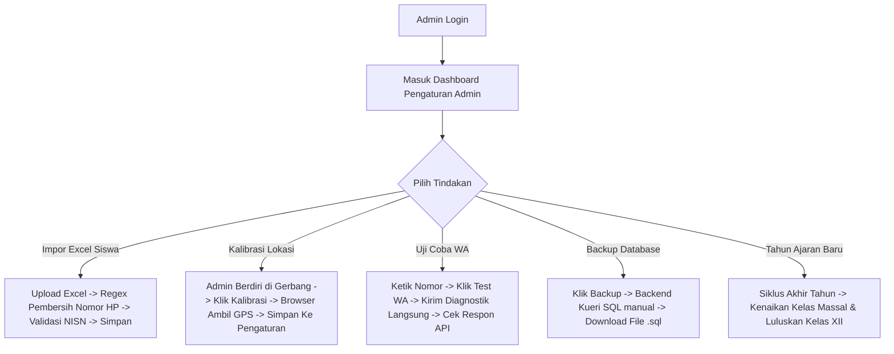

# Detail Fitur Lengkap — Dashboard Admin & Lifecycle (F-ADMIN)

Dokumen ini berisi spesifikasi kebutuhan fungsional, regex pembersih nomor WhatsApp, skema log audit JSON data, algoritma backup SQL cPanel, dan manajemen siklus tahunan sekolah untuk Admin.

---

## 1. Alur Kerja Utama (Happy Path Workflow)



---

## 2. Rincian Kebutuhan Fungsional & Teknis

### 2.1 F-DASH-ADMIN-06: Logika & Regex Auto-Formatter Nomor WhatsApp
*   **Masalah Input**: Staf Tata Usaha seringkali mengimpor nomor HP orang tua dengan format tidak beraturan (contoh: `08123456789`, `+62812-3456-789`, `62 812 3456 789`, atau bahkan karakter non-numerik lainnya).
*   **Implementasi nyata (`cleanWaPhone()` — hanya dipakai di CRUD manual `admin/students`)**:
    ```typescript
    function cleanWaPhone(phone: string): string {
      let cleaned = phone.replace(/\D/g, ""); // Hapus semua karakter non-digit
      if (cleaned.startsWith("0")) {
        cleaned = "62" + cleaned.slice(1); // 0xxx -> 62xxx
      }
      return cleaned;
    }
    ```
*   **⚠️ Perbedaan penting vs desain awal — wajib jadi acuan Laravel**:
    *   **Tidak ada validasi panjang minimal/maksimal digit** (klaim "10–15 digit, tolak jika di luar rentang" **belum diimplementasikan** di kode).
    *   **Tidak ada kode error `NOMOR_TELEPON_TIDAK_VALID`** — tidak ada baris yang ditolak karena format nomor.
    *   Nomor yang tidak diawali `0` (mis. sudah `62…` atau format lain) **dibiarkan apa adanya**.
    *   **Endpoint impor siswa XLSX (`/api/admin/students/import`) tidak memanggil fungsi cleaning ini sama sekali** — nomor mentah dari file Excel langsung disimpan ke `teleponOrangTua`.
    *   **Keputusan migrasi**: replikasi perilaku longgar ini apa adanya, atau naikkan ke validasi ketat (perlu approval eksplisit karena mengubah perilaku impor existing). Lihat [CATATAN_PARITAS.md](CATATAN_PARITAS.md).

### 2.2 F-DASH-ADMIN-07: Skema Log Audit Aktivitas Admin (LogAuditAdmin)
*   Setiap tindakan kritis Admin yang mengubah konfigurasi global atau kredensial pengguna wajib mencatat log audit ke tabel `LogAuditAdmin` dengan struktur data detail:
    ```json
    {
      "idPengguna": 1,
      "tindakan": "UPDATE_GPS",
      "target": "PENGATURAN_GPS_SEKOLAH",
      "detail": {
        "data_lama": {
          "latitude": -6.200000,
          "longitude": 106.800000,
          "radius": 50
        },
        "data_baru": {
          "latitude": -6.212345,
          "longitude": 106.828472,
          "radius": 100
        }
      }
    }
    ```
*   Aktivitas yang wajib mencatat log audit:
    *   Mengubah koordinat GPS atau radius sekolah.
    *   Mengubah jam masuk atau toleransi keterlambatan sekolah.
    *   Mereset password staff, guru, atau siswa.
    *   Mengubah token API WhatsApp Gateway.
    *   Melakukan kenaikan kelas massal atau kelulusan alumni.

### 2.3 F-DASH-ADMIN-08: Pengujian WhatsApp Gateway (Test WA Connector)
*   Di halaman pengaturan terdapat tombol `[Uji Koneksi WhatsApp]`.
*   Admin dapat memasukkan satu nomor tujuan uji coba (misal nomor HP Admin sendiri), lalu mengklik tombol tersebut.
*   Backend mengirimkan request uji coba langsung menggunakan kredensial yang tersimpan:
    *   **Fonnte** jika `wa_gateway_url` mengandung `fonnte.com` (atau default Fonnte).
    *   **OpenWA NestJS / CLI** jika URL self-hosted (deteksi session via `/api/sessions` bila tersedia).
*   Token diambil dari `Pengaturan.wa_gateway_token` (fallback `FONNTE_TOKEN`).
*   Sistem menampilkan feedback langsung di dashboard:
    *   Jika sukses: Status `"Sukses: Koneksi WhatsApp berfungsi dengan baik!"` (Warna hijau).
    *   Jika gagal: Status detail error (token invalid, session belum ready, kuota habis, timeout) (Warna merah).

> Panduan mendapat token Fonnte/OpenWA, menyimpan URL, antrean, dan error umum: **[WHATSAPP.md](WHATSAPP.md)**.

### 2.4 F-DASH-ADMIN-10: Algoritma Ekspor Cadangan SQL Database Satu-Klik
*   **Masalah Hosting**: Eksekusi perintah shell `mysqldump` dilarang keras di sebagian besar shared hosting cPanel murah karena alasan keamanan (*security policy disable_functions*).
*   **Algoritma Backup Manual via Laravel (Eloquent)**:
    1.  Backend mengambil seluruh daftar nama tabel di database MySQL (Pengguna, Kelas, Guru, Siswa, Kehadiran, LogWa, Pengaturan, HariLibur, LogAuditAdmin, LogKonselingBk, JadwalPiket, DispensasiKeterlambatan).
    2.  Untuk setiap tabel, backend melakukan kueri seluruh record via Eloquent, contoh: `Model::query()->get()`.
    3.  Backend melakukan iterasi dan menyusun teks perintah SQL `INSERT INTO namaTabel (kolom) VALUES (nilai)` secara manual di memori.
    4.  Backend menyisipkan perintah SQL pembuka berupa penangguhan konstrain kunci asing agar tidak terjadi error relasi saat pemulihan data:
        `"SET FOREIGN_KEY_CHECKS = 0;\n\n"`
    5.  Data dirangkum ke dalam satu string panjang SQL dan dikirimkan ke browser Admin sebagai file unduhan bertipe `.sql` (Content-Type: `application/octet-stream`).
    6.  Metode ini aman untuk data sekolah menengah dan cocok di shared hosting cPanel tanpa shell `mysqldump`.

### 2.5 F-DASH-ADMIN-11: Kirim Laporan Harian Manual (Opsi Tanpa Cron Job)
*   **Latar Belakang**: Pada hosting yang membatasi proses panjang, cron OS + `queue:work --stop-when-empty` atau tombol manual diperlukan sebagai cadangan.
*   **Mekanisme Tombol Kirim Laporan**:
    *   Halaman dasbor Admin (Pengaturan) menyediakan tombol `[Kirim Laporan Harian ke Wali Kelas]`.
    *   Tombol ini memanggil route API `/api/cron/wa-digest` dengan hak istimewa autentikasi Admin (atau secret cron).
    *   API akan langsung menghitung rekap absensi kelas pada hari itu dan mengantrikan pesan rekap WhatsApp ke masing-masing nomor Wali Kelas.
    *   Setiap kali pemicuan manual dilakukan, tindakan ini akan mencatat aktivitas log audit di `LogAuditAdmin` dengan tindakan `MANUAL_TRIGGER_WA_DIGEST`.

### 2.6 F-DASH-ADMIN-12: Reset Kata Sandi Siswa/Staf
*   Endpoint `PUT /api/admin/students` (dan `PUT /api/admin/users` untuk staf) mendukung mode **reset password**: body berisi flag reset (mis. `resetPassword: true`) untuk siswa target.
*   Password siswa direset ke **NISN siswa** (hash bcrypt), staf direset ke pola default yang dikonfigurasi.
*   Setelah reset, `isPasswordSementara` diset `true` sehingga pengguna wajib ganti sandi saat login berikutnya.
*   Aksi ini wajib memicu modal konfirmasi toast (bukan `window.confirm`) dan idealnya tercatat di `LogAuditAdmin` (`RESET_PASSWORD`).

### 2.7 F-DASH-ADMIN-13: Banner "Proses Alpha Manual" & Trigger Force
*   Dashboard Admin menampilkan **banner amber** ketika `ringkasanHariIni.belumAbsen > 0` (siswa yang belum tercatat kehadirannya sampai jam saat itu).
*   Banner menampilkan jumlah siswa belum absen + tombol `[Proses Alpha Manual]`.
*   Klik tombol → konfirmasi toast → `POST /api/attendance/auto-alpha` dengan body `{ force: true }` (memerlukan sesi `ADMIN`; lihat [ARSITEKTUR.md](ARSITEKTUR.md) §4.1 untuk aturan otorisasi ganda secret-vs-admin).
*   Setelah sukses, dashboard refresh ringkasan (`belumAbsen` menjadi 0) dan banner otomatis hilang.

---

## 3. Skenario Penanganan Error (Error Handling Matrix)

| Kondisi Error | Deteksi Sistem | Tindakan Sistem | Petunjuk Visual bagi Admin |
|---------------|----------------|-----------------|----------------------------|
| **Kenaikan Kelas Tabrakan** | Admin memicu kenaikan kelas massal namun ada siswa yang terdeteksi memiliki NISN duplikat di kelas tujuan | Transaksi database di-rollback otomatis | "Gagal Kenaikan Kelas: Terdapat duplikasi data NISN {NISN} pada kelas tujuan. Harap periksa dan koreksi data duplikat tersebut terlebih dahulu." |
| **Pembersihan Excel Gagal** | Berkas Excel yang diunggah Admin kosong atau kolom penting (NISN, Nama, Telepon Ortu) tidak ada | Validasi pembacaan pustaka Excel mendeteksi error struktur kolom | "Gagal Impor Excel: Struktur kolom tidak sesuai dengan template resmi. Harap unduh template resmi dan isi data kembali." |
| **Quota WA Habis** | Admin mencoba mengetes WhatsApp konektor namun API Fonnte mengembalikan saldo nol | Menangkap respons JSON Fonnte status error | "Koneksi Gagal: Saldo kuota paket WhatsApp Anda telah habis (Saldo: 0). Harap lakukan pengisian ulang kuota Fonnte." |

---

## 4. Rujukan Dokumen
*   Kembali ke [PRD Utama](PRD.md)
*   Lihat [Detail Spesifikasi Database](DATABASE.md)
*   Lihat [SOP.md](SOP.md)
