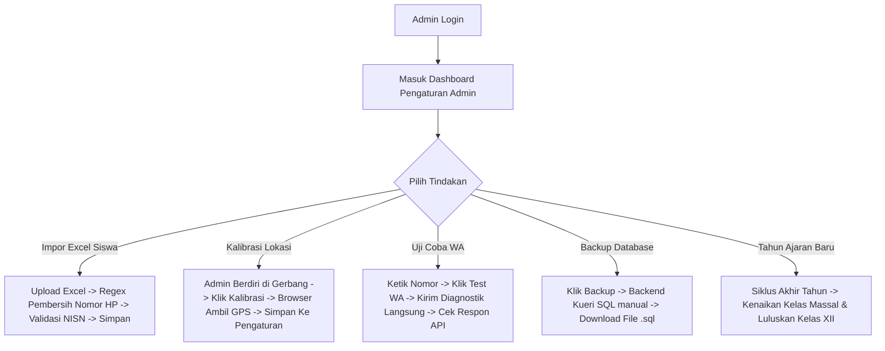

# Detail Fitur Lengkap — Dashboard Admin & Lifecycle (F-ADMIN)

Dokumen ini berisi spesifikasi kebutuhan fungsional, regex pembersih nomor WhatsApp, skema log audit JSON data, algoritma backup SQL cPanel, dan manajemen siklus tahunan sekolah untuk Admin.

---

## 1. Alur Kerja Utama (Happy Path Workflow)



---

## 2. Rincian Kebutuhan Fungsional & Teknis

### 2.1 F-DASH-ADMIN-06: Logika & Regex Auto-Formatter Nomor WhatsApp
*   **Masalah Input**: Staf Tata Usaha seringkali mengimpor nomor HP orang tua dengan format tidak beraturan (contoh: `08123456789`, `+62812-3456-789`, `62 812 3456 789`, atau bahkan karakter non-numerik lainnya).
*   **Logika Pembersihan Regex (Sanitization)**:
    *   Setiap nomor HP orang tua yang diinput (baik manual via form CRUD maupun massal via impor file Excel) wajib melewati fungsi penyaring (*sanitizer*) di backend Next.js:
    ```typescript
    export function bersihkanNomorHp(telepon: string): string {
      // 1. Hapus semua karakter non-numerik (kecuali angka)
      let bersih = telepon.replace(/\D/g, '');
      
      // 2. Jika diawali angka "0", ganti dengan kode negara "62"
      if (bersih.startsWith('0')) {
        bersih = '62' + bersih.substring(1);
      }
      
      // 3. Jika diawali "62", biarkan saja. Jika belum diawali, tambahkan "62" jika format lokal terdeteksi
      if (!bersih.startsWith('62') && bersih.startsWith('8')) {
        bersih = '62' + bersih;
      }
      
      return bersih;
    }
    ```
*   **Validasi Panjang Digit**: Setelah dibersihkan, nomor telepon harus memiliki panjang karakter minimal 10 digit dan maksimal 15 digit. Jika di luar jangkauan tersebut, baris data siswa bersangkutan dalam impor Excel ditolak dengan status error `NOMOR_TELEPON_TIDAK_VALID`.

### 2.2 F-DASH-ADMIN-07: Skema Log Audit Aktivitas Admin (LogAuditAdmin)
*   Setiap tindakan kritis Admin yang mengubah konfigurasi global atau kredensial pengguna wajib mencatat log audit ke tabel `LogAuditAdmin` dengan struktur data detail:
    ```json
    {
      "idPengguna": 1,
      "tindakan": "UPDATE_GPS",
      "target": "PENGATURAN_GPS_SEKOLAH",
      "detail": {
        "data_lama": {
          "latitude": -6.200000,
          "longitude": 106.800000,
          "radius": 50
        },
        "data_baru": {
          "latitude": -6.212345,
          "longitude": 106.828472,
          "radius": 100
        }
      }
    }
    ```
*   Aktivitas yang wajib mencatat log audit:
    *   Mengubah koordinat GPS atau radius sekolah.
    *   Mengubah jam masuk atau toleransi keterlambatan sekolah.
    *   Mereset password staff, guru, atau siswa.
    *   Mengubah token API WhatsApp Gateway.
    *   Melakukan kenaikan kelas massal atau kelulusan alumni.

### 2.3 F-DASH-ADMIN-08: Pengujian WhatsApp Gateway (Test WA Connector)
*   Di halaman pengaturan terdapat tombol `[Uji Koneksi WhatsApp]`.
*   Admin dapat memasukkan satu nomor tujuan uji coba (misal nomor HP Admin sendiri), lalu mengklik tombol tersebut.
*   Backend Next.js mengirimkan request uji coba langsung menggunakan kredensial token yang sedang disimpan ke provider WhatsApp API (Fonnte).
*   Sistem menampilkan feedback langsung di dashboard:
    *   Jika sukses: Status `"Sukses: Koneksi WhatsApp berfungsi dengan baik!"` (Warna hijau).
    *   Jika gagal: Status detail error `"Gagal: Bad Request (Token Tidak Valid / Kuota Habis)"` (Warna merah) untuk mempermudah diagnosa masalah tanpa harus menunggu hari esok.

### 2.4 F-DASH-ADMIN-10: Algoritma Ekspor Cadangan SQL Database Satu-Klik
*   **Masalah Hosting**: Eksekusi perintah shell `mysqldump` dilarang keras di sebagian besar shared hosting cPanel murah karena alasan keamanan (*security policy disable_functions*).
*   **Algoritma Backup Manual via Next.js Backend (Prisma)**:
    1.  Backend mengambil seluruh daftar nama tabel di database MySQL (Pengguna, Kelas, Guru, Siswa, Kehadiran, LogWa, Pengaturan, HariLibur, LogAuditAdmin, LogKonselingBk).
    2.  Untuk setiap tabel, backend melakukan kueri seluruh record data menggunakan:
        `const data = await prisma[namaTabel].findMany();`
    3.  Backend melakukan iterasi dan menyusun teks perintah SQL `INSERT INTO namaTabel (kolom) VALUES (nilai)` secara manual di memori.
    4.  Backend menyisipkan perintah SQL pembuka berupa penangguhan konstrain kunci asing agar tidak terjadi error relasi saat pemulihan data:
        `"SET FOREIGN_KEY_CHECKS = 0;\n\n"`
    5.  Data dirangkum ke dalam satu string panjang SQL dan dikirimkan ke browser Admin sebagai file unduhan bertipe `.sql` (Content-Type: `application/octet-stream`).
    6.  Metode ini dijamin 100% aman, cepat untuk data sekolah menengah (di bawah 10.000 siswa), dan berjalan lancar di shared hosting cPanel mana pun.

### 2.5 F-DASH-ADMIN-11: Kirim Laporan Harian Manual (Opsi Tanpa Cron Job)
*   **Latar Belakang**: Pada beberapa jenis server hosting (misalnya cPanel shared hosting yang membatasi hak eksekusi cron job eksternal atau mematikan background Node process), memicu tugas harian secara otomatis sulit dilakukan secara andal.
*   **Mekanisme Tombol Kirim Laporan**:
    *   Halaman dasbor Admin (Pengaturan) menyediakan tombol `[Kirim Laporan Harian ke Wali Kelas]`.
    *   Tombol ini memanggil route API `/api/cron/wa-digest` dengan hak istimewa autentikasi Admin/Piket.
    *   API akan langsung menghitung rekap absensi kelas pada hari itu dan menembakkan pesan rekap WhatsApp ke masing-masing nomor Wali Kelas.
    *   Setiap kali pemicuan manual dilakukan, tindakan ini akan mencatat aktivitas log audit di `LogAuditAdmin` dengan tindakan `MANUAL_TRIGGER_WA_DIGEST`.

---


## 3. Skenario Penanganan Error (Error Handling Matrix)

| Kondisi Error | Deteksi Sistem | Tindakan Sistem | Petunjuk Visual bagi Admin |
|---------------|----------------|-----------------|----------------------------|
| **Kenaikan Kelas Tabrakan** | Admin memicu kenaikan kelas massal namun ada siswa yang terdeteksi memiliki NISN duplikat di kelas tujuan | Transaksi database di-rollback otomatis | "Gagal Kenaikan Kelas: Terdapat duplikasi data NISN {NISN} pada kelas tujuan. Harap periksa dan koreksi data duplikat tersebut terlebih dahulu." |
| **Pembersihan Excel Gagal** | Berkas Excel yang diunggah Admin kosong atau kolom penting (NISN, Nama, Telepon Ortu) tidak ada | Validasi pembacaan pustaka Excel mendeteksi error struktur kolom | "Gagal Impor Excel: Struktur kolom tidak sesuai dengan template resmi. Harap unduh template resmi dan isi data kembali." |
| **Quota WA Habis** | Admin mencoba mengetes WhatsApp konektor namun API Fonnte mengembalikan saldo nol | Menangkap respons JSON Fonnte status error | "Koneksi Gagal: Saldo kuota paket WhatsApp Anda telah habis (Saldo: 0). Harap lakukan pengisian ulang kuota Fonnte." |

---

## 4. Rujukan Dokumen
*   Kembali ke [PRD Utama](PRD.md)
*   Lihat [Detail Spesifikasi Database](DATABASE.md)
*   Lihat [SOP.md](SOP.md)
