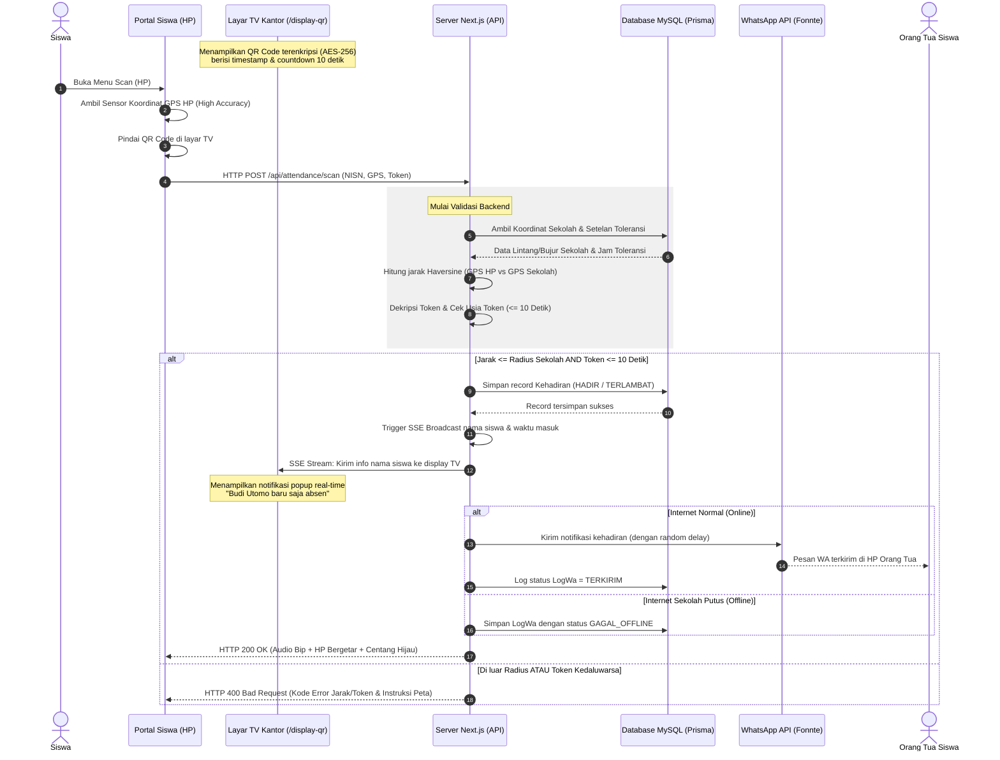
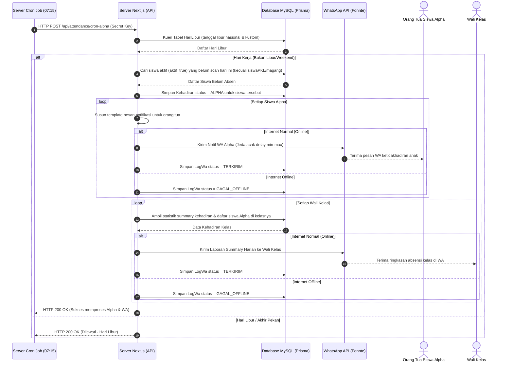
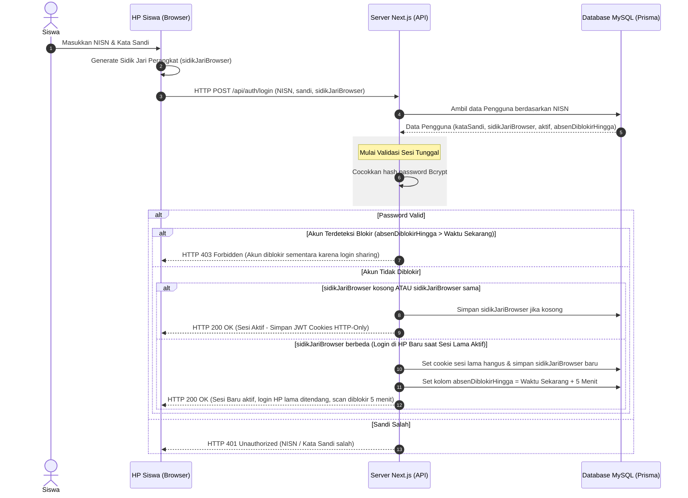
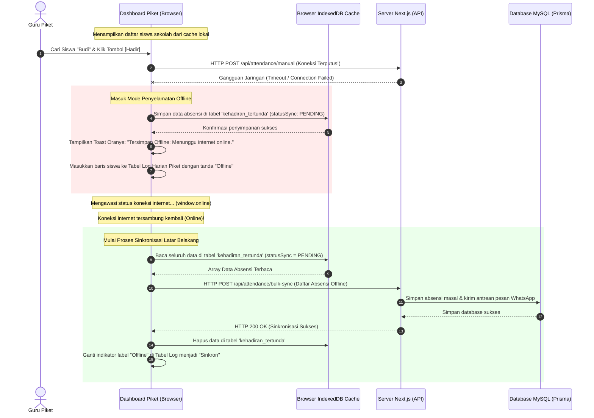
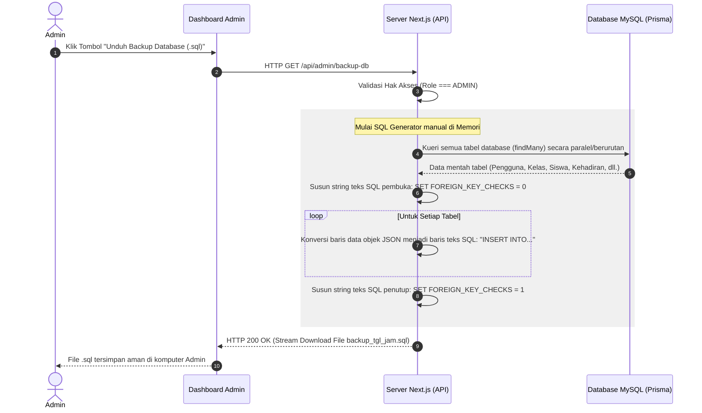

# Detail Alur & Alur Kerja Sistem (PRD-WORKFLOW)

Dokumen ini berisi spesifikasi diagram sekuens (*sequence diagram*) untuk lima alur utama sistem absensi SMK Ar Rahma guna memperjelas logika integrasi antarmuka dan basis data.

---

## 1. Alur Absensi Mandiri & Validasi QR Code (Scan Absen)

Siswa memindai QR Code TV kantor dari browser HP mereka. Validasi mencakup GPS Geofencing (Haversine) dan token TV dinamis (berubah tiap 10 detik).

---

## 2. Alur Otomasi Cron-Alpha Harian (07:15 WIB)

Sistem cron-job memicu penandaan status Alpha massal dan pengiriman laporan harian ke orang tua serta Wali Kelas setiap pagi.

---

## 3. Alur Sesi Tunggal & Sidik Jari Browser (Anti Login-Sharing)

Mencegah kecurangan siswa menitipkan absen dengan membagikan akun untuk di-login di HP teman yang berada di sekolah.

---

## 4. Alur Ketahanan Offline Guru Piket (IndexedDB & Auto-Sync)

Menjamin proses pencatatan absensi manual di gerbang sekolah tetap berjalan lancar saat koneksi Wi-Fi/internet sekolah terputus tiba-tiba.

---

## 5. Alur Pembuatan Cadangan SQL Database (One-Click cPanel Backup)

Admin mengekspor cadangan database MySQL. Menggunakan JSON kueri manual di memori server agar lolos dari aturan Shared Hosting cPanel yang memblokir `mysqldump` command line.

---

## 6. Rujukan Dokumen
*   Kembali ke [PRD Utama](PRD.md)
*   Lihat [Detail Spesifikasi Database](DATABASE.md)
*   Lihat [SOP.md](SOP.md)
