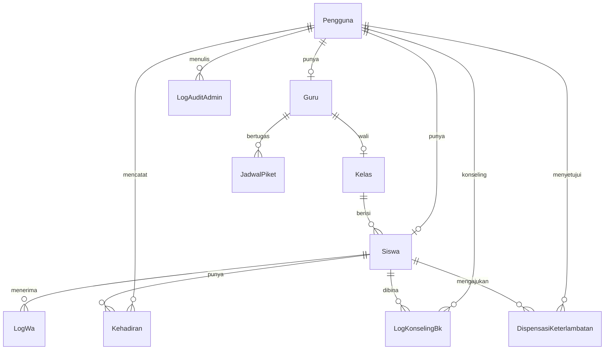

# Detail Spesifikasi Database (PRD-DB)

**Versi kamus data:** 2.1-L · **Tanggal:** 2026-07-29  
**Sumber kebenaran skema:** `docs/DATABASE.md` + `database/migrations/*` (Laravel)  
**ORM runtime:** Eloquent (`App\Models\*`) — **bukan** Prisma untuk aplikasi Laravel.

Dokumen ini berisi spesifikasi teknis dan kamus data (*data dictionary*) untuk database Sistem Absensi Siswa SMK Ar Rahma. Semua nama tabel, kolom, relasi, dan enum didefinisikan secara ketat dalam **Bahasa Indonesia**.

**Jumlah model:** 12 (`Pengguna`, `Kelas`, `Guru`, `Siswa`, `Kehadiran`, `LogWa`, `Pengaturan`, `HariLibur`, `LogAuditAdmin`, `LogKonselingBk`, `JadwalPiket`, `DispensasiKeterlambatan`).

### Catatan Eloquent (Migrasi Laravel)
* Map model 1:1 ke tabel; set `CREATED_AT`/`UPDATED_AT` ke `dibuatPada`/`diubahPada` bila kolom memakai nama Indonesia.
* Kolom password auth: `kataSandi` (override `getAuthPassword()`).
* Enum PHP di `App\Enums\*` harus sinkron dengan enum MySQL di bawah.
* **Jangan** rename kolom ke `snake_case` English tanpa persetujuan eksplisit — data existing mengandalkan nama ini.
* File `prisma/schema.prisma` (jika masih ada) hanya referensi historis.

---

## 0. Diagram Relasi (ER Ringkas)

---

## 1. Tipe Data & Struktur Enumerasi (Enum)

Database MySQL ini menggunakan enumerasi khusus untuk menjamin validitas data:

### 1.1 Peran
Menentukan tingkat hak akses (RBAC) pengguna di dalam sistem dashboard absensi.
*   `ADMIN`: Hak akses penuh ke semua pengaturan, master data, backup, dan log audit.
*   `KEPALA_SEKOLAH`: Hak akses baca global, visualisasi eksekutif, dan unduh laporan keseluruhan.
*   `GURU`: Hak akses umum untuk guru (Wali Kelas, Guru Piket, Guru BK ditentukan oleh flag `isBk` dan `jadwalPiket` pada model Guru).
*   `SISWA`: Hak akses portal HP mandiri untuk melakukan scan QR kehadiran.

> **Catatan:** Role `WALI_KELAS`, `GURU_BK`, dan `GURU_PIKET` dari desain awal telah disederhanakan menjadi satu role `GURU` dengan flag boolean `isBk` pada model Guru untuk menandakan Guru BK, serta relasi `jadwalPiket` untuk menentukan Guru Piket. Wali Kelas ditentukan oleh relasi `kelasWali` pada model Guru.

### 1.2 StatusKehadiran
Menentukan status kehadiran harian siswa yang terekam.
*   `HADIR`: Siswa melakukan scan QR sukses sebelum jam masuk sekolah berakhir.
*   `TERLAMBAT`: Siswa melakukan scan QR sukses setelah jam masuk sekolah namun sebelum batas toleransi habis.
*   `SAKIT`: Siswa tidak hadir dengan melampirkan keterangan surat sakit dokter (diinput manual oleh Piket/Wali Kelas).
*   `IZIN`: Siswa tidak hadir dengan keterangan surat izin resmi orang tua (diinput manual oleh Piket/Wali Kelas).
*   `ALPHA`: Siswa tidak hadir tanpa keterangan setelah batas waktu toleransi berakhir (diubah otomatis oleh sistem cron-job).

### 1.3 StatusLogWa
Menentukan status pengiriman notifikasi pesan WhatsApp Gateway.
*   `TERKIRIM`: Pesan berhasil terkirim dari server dan sukses diterima oleh Fonnte/Gateway.
*   `GAGAL`: Pesan gagal dikirim karena kesalahan format nomor HP orang tua atau penolakan server API.
*   `GAGAL_OFFLINE`: Pesan gagal terkirim karena koneksi internet sekolah terputus total saat cron-job berjalan. **Catatan implementasi:** status ini ada di enum tapi **tidak pernah di-set** oleh kode `WhatsAppService`/`kirimWaLangsung` saat ini — semua kegagalan (jaringan maupun gateway) jatuh ke status `GAGAL` generik. Efektif status ini **belum terpakai**; putuskan apakah Laravel mengaktifkannya (bedakan gagal-jaringan vs gagal-gateway) atau tetap tidak dipakai.
*   `TERTUNDA`: Pesan masuk ke dalam antrean (delay acak) dan sedang menunggu giliran untuk dikirim.

### 1.4 HariPiket
Hari kerja untuk penjadwalan Guru Piket (`JadwalPiket.hari`):
*   `SENIN` | `SELASA` | `RABU` | `KAMIS` | `JUMAT` | `SABTU`

### 1.5 StatusDispensasi
Status pengajuan dispensasi keterlambatan siswa:
*   `MENUNGGU`: Baru diajukan, menunggu verifikasi Guru Piket/Admin.
*   `DISETUJUI`: Dispensasi diterima; `disetujuiOleh` terisi.
*   `DITOLAK`: Dispensasi ditolak.

---

## 2. Kamus Data Tabel (*Data Dictionary*)

### 2.1 Tabel: Pengguna
Menyimpan kredensial login, peran, sidik jari perangkat, dan status blokir seluruh pengguna sistem (staf, guru, admin, siswa).

| Nama Kolom | Tipe Data | Nullable | Atribut / Key | Keterangan |
|------------|-----------|----------|---------------|------------|
| `id` | INT | No | Primary Key, Auto Increment | ID unik pengguna |
| `nama` | VARCHAR(100) | No | - | Nama lengkap pengguna |
| `email` | VARCHAR(100) | No | Unique Index | Email login (atau NISN@arrahma.sch.id untuk siswa) |
| `kataSandi` | VARCHAR(255) | No | - | Password terenkripsi hash Bcrypt |
| `peran` | ENUM(Peran) | No | Default: `SISWA` | Level hak akses (RBAC) pengguna |
| `isPasswordSementara` | BOOLEAN | No | Default: `true` | Penanda wajib ganti password di login pertama |
| `aktif` | BOOLEAN | No | Default: `true` | Penanda akun aktif atau dinonaktifkan (alumni/pensiun) |
| `sidikJariBrowser` | TEXT | Yes | - | String fingerprint browser untuk sesi tunggal |
| `absenDiblokirHingga` | DATETIME | Yes | - | Batas waktu blokir scan jika melanggar sesi tunggal |
| `dibuatPada` | DATETIME | No | Default: `CURRENT_TIMESTAMP` | Tanggal pembuatan akun |
| `diubahPada` | DATETIME | No | On Update `CURRENT_TIMESTAMP`| Tanggal perubahan data akun terakhir |

---

### 2.2 Tabel: Kelas
Menyimpan nama-nama kelas di SMK Ar Rahma beserta wali kelas yang ditugaskan.

| Nama Kolom | Tipe Data | Nullable | Atribut / Key | Keterangan |
|------------|-----------|----------|---------------|------------|
| `id` | INT | No | Primary Key, Auto Increment | ID unik kelas |
| `nama` | VARCHAR(50) | No | Unique Index | Nama kelas (e.g. "X RPL 1", "XI TKR 2") |
| `tahunAjaran` | VARCHAR(20) | No | - | Tahun ajaran aktif kelas (e.g. "2025/2026") |
| `idGuru` | INT | Yes | Foreign Key, **Unique Index** | ID Guru yang menjadi wali kelas (relasi ke `Guru.id`). Karena kolom ini **unik**, satu Guru **hanya bisa** menjadi wali dari **satu** kelas (constraint 1:1 di level database, bukan sekadar konvensi UI). |
| `dibuatPada` | DATETIME | No | Default: `CURRENT_TIMESTAMP` | Waktu kelas didaftarkan |
| `diubahPada` | DATETIME | No | On Update `CURRENT_TIMESTAMP`| Waktu perubahan data kelas terakhir |

*   **Aksi Referensial (FK Constraints)**:
    *   `idGuru` $\rightarrow$ `Guru.id`: `ON DELETE SET NULL` `ON UPDATE CASCADE` (jika data guru dihapus, kelas tetap ada tetapi wali kelas kosong).

---

### 2.3 Tabel: Guru
Menyimpan informasi profil detail khusus untuk Guru.

| Nama Kolom | Tipe Data | Nullable | Atribut / Key | Keterangan |
|------------|-----------|----------|---------------|------------|
| `id` | INT | No | Primary Key, Auto Increment | ID unik guru |
| `nip` | VARCHAR(30) | Yes | Unique Index | Nomor Induk Pegawai (jika ada) |
| `telepon` | VARCHAR(20) | Yes | - | Nomor WhatsApp aktif untuk laporan harian otomatis |
| `idPengguna` | INT | No | Foreign Key, Unique Index | ID akun relasi ke `Pengguna.id` |
| `isBk` | BOOLEAN | No | Default: `false` | `true` jika guru berperan sebagai Guru BK |
| `dibuatPada` | DATETIME | No | Default: `CURRENT_TIMESTAMP` | Waktu data guru dibuat |
| `diubahPada` | DATETIME | No | On Update `CURRENT_TIMESTAMP`| Waktu perubahan data guru terakhir |

*   **Relasi turunan**: `kelasWali` (0..1 `Kelas`), `jadwalPiket` (0..n `JadwalPiket`).
*   **Aksi Referensial (FK Constraints)**:
    *   `idPengguna` $\rightarrow$ `Pengguna.id`: `ON DELETE CASCADE` `ON UPDATE CASCADE` (jika akun Pengguna dihapus, data profil Guru otomatis ikut terhapus).

---

### 2.4 Tabel: Siswa
Menyimpan informasi detail profil khusus siswa beserta status keaktifan magang.

| Nama Kolom | Tipe Data | Nullable | Atribut / Key | Keterangan |
|------------|-----------|----------|---------------|------------|
| `id` | INT | No | Primary Key, Auto Increment | ID unik siswa |
| `nisn` | VARCHAR(20) | No | Unique Index | Nomor Induk Siswa Nasional (digunakan untuk login) |
| `nama` | VARCHAR(100) | No | - | Nama lengkap siswa |
| `idKelas` | INT | No | Foreign Key, Index | ID kelas siswa (relasi ke `Kelas.id`) |
| `teleponOrangTua` | VARCHAR(20) | No | - | Nomor WhatsApp orang tua dalam format internasional |
| `sedangMagang` | BOOLEAN | No | Default: `false` | Status keaktifan siswa sedang magang/PKL |
| `tanggalMulaiMagang` | DATETIME | Yes | - | Tanggal mulai periode magang luar sekolah |
| `tanggalSelesaiMagang`| DATETIME | Yes | - | Tanggal selesai periode magang luar sekolah |
| `idPengguna` | INT | No | Foreign Key, Unique Index | ID akun relasi ke `Pengguna.id` |
| `dibuatPada` | DATETIME | No | Default: `CURRENT_TIMESTAMP` | Waktu siswa didaftarkan |
| `diubahPada` | DATETIME | No | On Update `CURRENT_TIMESTAMP`| Waktu perubahan data siswa terakhir |

*   **Aksi Referensial (FK Constraints)**:
    *   `idKelas` $\rightarrow$ `Kelas.id`: `ON DELETE RESTRICT` `ON UPDATE CASCADE` (tidak boleh menghapus kelas jika masih ada siswa di dalamnya).
    *   `idPengguna` $\rightarrow$ `Pengguna.id`: `ON DELETE CASCADE` `ON UPDATE CASCADE` (jika akun Pengguna dihapus, data profil Siswa otomatis ikut terhapus).

---

### 2.5 Tabel: Kehadiran
Menyimpan data catatan absensi harian siswa.

| Nama Kolom | Tipe Data | Nullable | Atribut / Key | Keterangan |
|------------|-----------|----------|---------------|------------|
| `id` | INT | No | Primary Key, Auto Increment | ID unik kehadiran |
| `idSiswa` | INT | No | Foreign Key, Index | ID siswa (relasi ke `Siswa.id`) |
| `tanggal` | DATE | No | Unique Index (Composite) | Tanggal absensi (hanya tanggal, tanpa jam) |
| `tahunAjaran` | VARCHAR(20) | No | Index, Default `"2024/2025"` | Tahun ajaran untuk filter rekap cepat. ⚠️ Default hardcoded ini **usang** dan perlu di-update tiap pergantian tahun ajaran (mis. via config/seed) — bukan dihitung otomatis dari tanggal berjalan. **Diisi otomatis** oleh endpoint `scan` dan `manual` dari `siswa.kelas.tahunAjaran`, tapi endpoint `bulk-sync` (offline piket) **tidak mengisinya** sehingga jatuh ke default ini. |
| `status` | ENUM(StatusKehadiran)| No | Default: `HADIR` | Status kehadiran siswa pada hari tersebut |
| `waktuMasuk` | DATETIME | Yes | - | Timestamp persis jam sukses pemindaian/input manual |
| `latitude` | FLOAT | Yes | - | Titik koordinat latitude lokasi saat scan di HP (null jika geofencing off) |
| `longitude` | FLOAT | Yes | - | Titik koordinat longitude lokasi saat scan di HP |
| `dicatatOleh` | INT | Yes | Foreign Key | ID akun pengguna yang mencatat manual (jika Piket/Wali) |
| `catatan` | VARCHAR(255) | Yes | - | Keterangan izin/sakit/kegiatan khusus |
| `dibuatPada` | DATETIME | No | Default: `CURRENT_TIMESTAMP` | Tanggal pembuatan record absensi |
| `diubahPada` | DATETIME | No | On Update `CURRENT_TIMESTAMP`| Tanggal pengubahan record absensi terakhir |

*   **Indeks & Keunikan Konstrain**:
    *   `@@unique([idSiswa, tanggal])`: Menjamin satu siswa hanya memiliki satu status kehadiran per hari.
    *   `@@index([tanggal, status])`: Dioptimalkan untuk kueri cepat statistik dashboard harian.
    *   `@@index([tahunAjaran])`: Optimasi rekap per tahun ajaran.
*   **Aksi Referensial (FK Constraints)**:
    *   `idSiswa` $\rightarrow$ `Siswa.id`: `ON DELETE CASCADE` `ON UPDATE CASCADE` (jika siswa dihapus, seluruh riwayat kehadirannya terhapus otomatis).
    *   `dicatatOleh` $\rightarrow$ `Pengguna.id`: `ON DELETE SET NULL` `ON UPDATE CASCADE` (jika akun staf pencatat dihapus, status absensi tetap ada dengan keterangan pencatat kosong).

---

### 2.6 Tabel: LogWa
Menyimpan log pengiriman notifikasi WhatsApp ke nomor orang tua/staf sebagai data monitoring.

| Nama Kolom | Tipe Data | Nullable | Atribut / Key | Keterangan |
|------------|-----------|----------|---------------|------------|
| `id` | INT | No | Primary Key, Auto Increment | ID unik log WA |
| `idSiswa` | INT | No | Foreign Key, Index | ID siswa penerima notifikasi (relasi ke `Siswa.id`) |
| `telepon` | VARCHAR(20) | No | - | Nomor WhatsApp tujuan pesan dikirim |
| `pesan` | TEXT | No | - | Isi lengkap teks pesan yang dikirimkan |
| `status` | ENUM(StatusLogWa) | No | Default: `TERTUNDA` | Status pengiriman notifikasi saat ini |
| `error` | TEXT | Yes | - | Pesan error dari server API jika pengiriman gagal |
| `sentAt` | DATETIME | No | Default: `CURRENT_TIMESTAMP` | Waktu log dibuat atau waktu pesan terkirim |

*   **Aksi Referensial (FK Constraints)**:
    *   `idSiswa` $\rightarrow$ `Siswa.id`: `ON DELETE CASCADE` `ON UPDATE CASCADE` (jika data siswa dihapus, riwayat log pesan WA-nya ikut terhapus).

---

### 2.7 Tabel: Pengaturan
Menyimpan konfigurasi parameter sistem absensi bertipe key-value secara dinamis.

| Nama Kolom | Tipe Data | Nullable | Atribut / Key | Keterangan |
|------------|-----------|----------|---------------|------------|
| `id` | INT | No | Primary Key, Auto Increment | ID unik pengaturan |
| `kunci` | VARCHAR(100) | No | Unique Index | Kunci identifikasi (e.g. `gps_latitude`, `jam_masuk`) |
| `nilai` | TEXT | No | - | Nilai dari konfigurasi yang disimpan |
| `dibuatPada` | DATETIME | No | Default: `CURRENT_TIMESTAMP` | Tanggal pembuatan parameter |
| `diubahPada` | DATETIME | No | On Update `CURRENT_TIMESTAMP`| Tanggal perubahan parameter terakhir |

*   **Isi Data Awal Default (Seeding) — nilai persis dari seed produk existing**:

| Kunci | Nilai default seed |
|-------|---------------------|
| `gps_sekolah_latitude` | `-7.8014` |
| `gps_sekolah_longitude` | `112.0123` |
| `gps_sekolah_radius` | `50` (meter) |
| `gps_geofencing_aktif` | `"true"` |
| `wa_gateway_token` | `"fonnte_token_placeholder"` (belum dikonfigurasi — kirim WA ditolak sampai diganti) |
| `wa_delay_min` | `2` (detik) |
| `wa_delay_max` | `5` (detik) |
| `jam_masuk` | `"07:00"` |
| `jam_toleransi` | `"07:15"` |

> Kunci `wa_gateway_url` **tidak** ada di seed default — sistem fallback ke `https://api.fonnte.com` bila kosong. Isi manual di Admin Settings hanya jika memakai OpenWA self-hosted. Panduan lengkap: [WHATSAPP.md](WHATSAPP.md).
    *   `jam_masuk`: Batas jam hadir normal (e.g. `"07:00"`).
    *   `jam_toleransi`: Batas toleransi terlambat (e.g. `"07:15"`).

---

### 2.8 Tabel: HariLibur
Menyimpan hari libur sekolah (nasional maupun kustom lokal internal sekolah).

| Nama Kolom | Tipe Data | Nullable | Atribut / Key | Keterangan |
|------------|-----------|----------|---------------|------------|
| `id` | INT | No | Primary Key, Auto Increment | ID unik hari libur |
| `tanggal` | DATE | No | Unique Index | Tanggal hari libur sekolah |
| `nama` | VARCHAR(150) | No | - | Deskripsi nama libur (e.g. "Hari Raya Idul Fitri") |
| `isKustom` | BOOLEAN | No | Default: `false` | Penanda libur internal sekolah (bukan libur nasional) |
| `dibuatPada` | DATETIME | No | Default: `CURRENT_TIMESTAMP` | Waktu pencatatan dibuat |
| `diubahPada` | DATETIME | No | On Update `CURRENT_TIMESTAMP`| Waktu perubahan terakhir |

---

### 2.9 Tabel: LogAuditAdmin
Menyimpan log audit keamanan dari segala aktivitas kritis yang dilakukan Admin.

| Nama Kolom | Tipe Data | Nullable | Atribut / Key | Keterangan |
|------------|-----------|----------|---------------|------------|
| `id` | INT | No | Primary Key, Auto Increment | ID unik log audit |
| `idPengguna` | INT | No | Foreign Key, Index | ID akun Admin pelaksana (relasi ke `Pengguna.id`) |
| `tindakan` | VARCHAR(100) | No | - | Nama aktivitas (e.g. "UPDATE_GPS", "RESET_PASSWORD") |
| `target` | VARCHAR(100) | No | - | Objek target yang diubah (e.g. "PENGGUNA_SISWA_12", "CONFIG_GLOBAL") |
| `detail` | TEXT | No | - | Detail data JSON berisi data lama vs data baru setelah diubah |
| `createdAt` | DATETIME | No | Default: `CURRENT_TIMESTAMP` | Waktu persis aktivitas log audit dicatat |

*   **Aksi Referensial (FK Constraints)**:
    *   `idPengguna` $\rightarrow$ `Pengguna.id`: `ON DELETE RESTRICT` `ON UPDATE CASCADE` (tidak boleh menghapus akun Admin jika memiliki riwayat log audit untuk menjaga integritas).

---

### 2.10 Tabel: LogKonselingBk
Menyimpan catatan riwayat hasil pembinaan bimbingan konseling oleh Guru BK/Admin.

| Nama Kolom | Tipe Data | Nullable | Atribut / Key | Keterangan |
|------------|-----------|----------|---------------|------------|
| `id` | INT | No | Primary Key, Auto Increment | ID unik log konseling |
| `idSiswa` | INT | No | Foreign Key, Index | ID siswa yang dibimbing (relasi ke `Siswa.id`) |
| `idBk` | INT | No | Index | ID akun Guru BK pelaksana bimbingan (relasi ke `Pengguna.id`) |
| `detail` | TEXT | No | - | Isi lengkap teks hasil konseling rahasia siswa |
| `dibuatPada` | DATETIME | No | Default: `CURRENT_TIMESTAMP` | Tanggal pembuatan catatan konseling |
| `diubahPada` | DATETIME | No | On Update `CURRENT_TIMESTAMP`| Tanggal perubahan catatan konseling terakhir |

*   **Aksi Referensial (FK Constraints)**:
    *   `idSiswa` $\rightarrow$ `Siswa.id`: `ON DELETE CASCADE` `ON UPDATE CASCADE` (jika siswa dihapus, log konselingnya otomatis terhapus).
    *   `idBk` $\rightarrow$ `Pengguna.id`: `ON DELETE RESTRICT` `ON UPDATE CASCADE`.

---

### 2.11 Tabel: JadwalPiket
Menyimpan penugasan Guru Piket per hari kerja.

| Nama Kolom | Tipe Data | Nullable | Atribut / Key | Keterangan |
|------------|-----------|----------|---------------|------------|
| `id` | INT | No | Primary Key, Auto Increment | ID unik jadwal |
| `hari` | ENUM(HariPiket) | No | Unique Composite | Hari piket |
| `idGuru` | INT | No | Foreign Key, Unique Composite | Guru yang bertugas |
| `dibuatPada` | DATETIME | No | Default: `CURRENT_TIMESTAMP` | Waktu dibuat |
| `diubahPada` | DATETIME | No | On Update `CURRENT_TIMESTAMP` | Waktu diubah |

*   **Indeks & Keunikan**: `@@unique([hari, idGuru])` — kombinasi (hari, guru) unik: satu guru tidak bisa piket dobel di hari yang sama, **tapi** guru yang sama boleh dijadwalkan di banyak hari berbeda (mis. Senin–Sabtu), dan satu hari boleh punya beberapa guru piket berbeda.
*   **FK**: `idGuru` → `Guru.id` `ON DELETE CASCADE` `ON UPDATE CASCADE`.

---

### 2.12 Tabel: DispensasiKeterlambatan
Menyimpan pengajuan dispensasi keterlambatan oleh siswa beserta keputusan staf.

| Nama Kolom | Tipe Data | Nullable | Atribut / Key | Keterangan |
|------------|-----------|----------|---------------|------------|
| `id` | INT | No | Primary Key, Auto Increment | ID unik dispensasi |
| `idSiswa` | INT | No | Foreign Key, Unique Composite | Siswa pengaju |
| `tanggal` | DATE | No | Unique Composite | Tanggal terkait pengajuan |
| `alasan` | TEXT | No | - | Alasan keterlambatan |
| `fotoBukti` | VARCHAR(255) | Yes | - | Path/URL foto bukti (opsional) |
| `status` | ENUM(StatusDispensasi) | No | Default: `MENUNGGU` | Status verifikasi |
| `disetujuiOleh` | INT | Yes | Foreign Key | `Pengguna.id` piket/admin yang memutuskan |
| `dibuatPada` | DATETIME | No | Default: `CURRENT_TIMESTAMP` | Waktu diajukan |
| `diubahPada` | DATETIME | No | On Update `CURRENT_TIMESTAMP` | Waktu diubah |

*   **Indeks & Keunikan**: `@@unique([idSiswa, tanggal])`.
*   **FK**:
    *   `idSiswa` → `Siswa.id` `ON DELETE CASCADE` `ON UPDATE CASCADE`
    *   `disetujuiOleh` → `Pengguna.id` `ON DELETE SET NULL` `ON UPDATE CASCADE`

---

## 3. Rencana Pengarsipan & Integritas Data

1.  **Pengarsipan Historis**: Saat proses kelulusan akhir tahun ajaran berjalan, akun siswa kelas XII di-set `aktif: false` pada tabel `Pengguna`. Hal ini menonaktifkan portal login dan scan, namun menjaga record data relasi `Siswa`, `Kehadiran`, dan `LogKonselingBk` tetap tersimpan secara historis untuk kebutuhan pencarian data lulusan.
2.  **Kunci Asing (Foreign Keys)**: Semua relasi database dipasang di tingkat mesin MySQL (*InnoDB Engine*) dengan konstrain Cascade untuk penghapusan data anak (seperti Siswa & Kehadiran), dan Restrict pada data utama (seperti Kelas ke Siswa) untuk mencegah ketidaksinkronan data.
3.  **Rekap per Tahun Ajaran**: Kolom `Kehadiran.tahunAjaran` mempercepat filter laporan tanpa join tambahan ke kelas historis.

---

## 4. Rujukan Dokumen
*   [PRD.md](PRD.md) · [SRS.md](SRS.md) · [SOP.md](SOP.md) · [MIGRASI_LARAVEL.md](MIGRASI_LARAVEL.md) · [API.md](API.md)
*   Implementasi: `database/migrations/` + `app/Models/`

