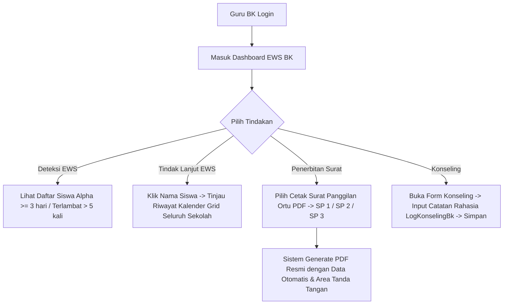

# Detail Fitur Lengkap — Dashboard Guru BK (F-BK)

Dokumen ini berisi spesifikasi fungsional, arsitektur Early Warning System (EWS), format Surat Panggilan Orang Tua format PDF, dan keamanan catatan pembinaan konseling untuk Guru BK (akses seluruh kelas).

---

## 1. Alur Kerja Utama (Happy Path Workflow)

---

## 2. Rincian Kebutuhan Fungsional & Teknis

### 2.1 F-DASH-BK-01: Algoritma & Logika Early Warning System (EWS)

> **⚠️ Implementasi nyata lebih sederhana dari desain awal.** Endpoint `GET /api/bk/ews` **hanya** mengevaluasi 2 kriteria, dalam window **bulan kalender berjalan** (1 s.d. akhir bulan ini, bukan semester):
> 1. **`maxConsecutiveAlpha >= 3`** — Alpha 3 hari berturut-turut (dihitung ulang dari 0 setiap kali ada status non-Alpha di antaranya) dalam bulan berjalan.
> 2. **`totalTerlambat > 5`** — total Terlambat lebih dari 5 kali dalam bulan berjalan.
>
> Kriteria berikut **disebut di desain awal tapi TIDAK ada implementasinya** di kode saat ini:
> * Akumulasi Alpha ≥ 5 hari per **semester** (kode hanya cek per bulan berjalan, bukan semester).
> * Kriteria mingguan "terlambat ≥ 3 kali dalam Senin–Jumat berjalan" (F-DASH-BK-05) — tidak ada query window mingguan di kode.
>
> **Keputusan migrasi**: bangun ulang `EwsService` Laravel mengikuti 2 kriteria bulanan di atas (parity apa adanya), **atau** implementasikan kriteria semester + mingguan sebagai perbaikan produk baru — butuh persetujuan eksplisit karena menambah scope. Lihat [CATATAN_PARITAS.md](CATATAN_PARITAS.md).

*   **Logika Peringatan Dini EWS (sesuai kode nyata)**:
    *   Sistem memindai data absensi seluruh siswa aktif pada rentang **1 s.d. akhir bulan kalender berjalan** setiap kali halaman/endpoint EWS diakses (bukan cron terjadwal terpisah).
    *   **Kriteria Rawan Alpha**: Siswa dengan `StatusKehadiran = ALPHA` sebanyak **3 hari berturut-turut** dalam bulan berjalan.
    *   **Kriteria Rawan Terlambat**: Siswa dengan `StatusKehadiran = TERLAMBAT` sebanyak **lebih dari 5 kali** (`> 5`, bukan `>= 5`) dalam bulan berjalan.
    *   Siswa bisa memenuhi kedua kriteria sekaligus; `ewsReason` menggabungkan keduanya dengan `" & "`.
    *   Hak akses: `ADMIN`, `KEPALA_SEKOLAH`, atau `GURU` dengan `Guru.isBk = true` (dicek via query relasi, bukan klaim role token).
*   **Penyajian UI/UX EWS**:
    *   Daftar siswa bermasalah ditampilkan di tabel paling atas dashboard BK dengan baris berwarna merah pudar untuk siswa rawan SP dan kuning untuk siswa rawan keterlambatan akumulatif.
    *   Tabel menampilkan kolom: Nama Siswa, Kelas, Wali Kelas, Kategori Pelanggaran (e.g. "Alpha 3 Hari Berturut-turut"), dan Aksi Cepat (`[Tinjau Profil]`, `[Cetak Surat Panggilan]`).

### 2.2 F-DASH-BK-04: Format & Layout Surat Panggilan Orang Tua (SP 1, SP 2, SP 3)
*   **Struktur Dokumen PDF Surat Panggilan Resmi**:
    *   File PDF dihasilkan secara dinamis di server menggunakan pustaka `@react-pdf/renderer` saat tombol ditekan.
    *   **Bagian Kepala (Kop Surat)**: Memuat logo resmi SMK Ar Rahma di sebelah kiri, nama yayasan, nama sekolah, alamat lengkap gerbang sekolah, nomor telepon, dan email sekolah secara simetris dengan garis pemisah tebal ganda di bawah kop.
    *   **Bagian Pembuka**: Nomor Surat (ter-generate otomatis berdasarkan format urutan administrasi sekolah, e.g. `105/SMK-AR/SP-I/2026`), Lampiran: `-`, Perihal: `Surat Panggilan Orang Tua / Wali Murid (Panggilan Ke-X)`.
    *   **Bagian Isi Surat**:
        `"Berdasarkan data kehadiran siswa pada Sistem Absensi SMK Ar Rahma, kami mengabarkan bahwa putra/putri Bapak/Ibu: nama siswa, kelas, NISN terdata tidak hadir tanpa keterangan (ALPHA) sebanyak X hari pada tanggal: {Rincian_Tanggal_Alpha}. Sehubungan dengan hal tersebut, kami mengharapkan kehadiran Bapak/Ibu pada: Hari/Tanggal, Waktu, Tempat (Ruang BK) untuk berkoordinasi..."`
    *   **Tingkatan SP Bertingkat**:
        *   **SP 1 (Panggilan Ke-1)**: Teks himbauan koordinasi ramah.
        *   **SP 2 (Panggilan Ke-2)**: Teks penegasan penting dengan melampirkan riwayat panggilan pertama yang tidak dihadiri.
        *   **SP 3 (Panggilan Ke-3 / Terakhir)**: Teks peringatan keras terkait kelanjutan status siswa di sekolah.
    *   **Bagian Penutup**: Tanda tangan Guru BK pelaksana, Kepala Sekolah (mengetahui), dan ruang tanda tangan Orang Tua Wali saat hadir.

### 2.3 F-DASH-BK-06: Log Pembinaan BK Rahasia (LogKonselingBk)
*   **Keamanan Data Rahasia**:
    *   Hasil konseling siswa bermasalah dimasukkan ke dalam tabel database terpisah yaitu `LogKonselingBk`.
    *   Form input mencakup: `idSiswa`, `idBk` (ID Staf BK yang menginput), dan `detail` (VARCHAR TEXT isi catatan konseling).
    *   **Aturan Hak Akses (RBAC)**:
        *   Hanya Guru BK dan Admin yang berwenang untuk menulis, mengubah, atau menghapus catatan konseling ini.
        *   Wali Kelas dari siswa yang bersangkutan diperbolehkan untuk membaca isi catatan konseling tersebut di halaman profil detail siswa di dashboard-nya untuk menyelaraskan pembinaan kelas, namun tidak memiliki hak untuk melakukan edit/hapus.
        *   Siswa dan Kepala Sekolah tidak memiliki akses membaca data detail log konseling ini (Kepala Sekolah hanya melihat status "Sudah Dibina / Belum Dibina").

### 2.4 F-DASH-BK-07: Log Cetak Surat Panggilan
*   Sistem mencatat riwayat cetak dokumen di halaman profil siswa:
    *   `"Guru BK {Nama_BK} mencetak Surat Panggilan Ke-X pada {Tanggal} pukul {Jam}."`
    *   Data ini direkam di tabel database untuk pelacakan tertib administrasi sekolah.

---

## 3. Skenario Penanganan Error (Error Handling Matrix)

| Kondisi Error | Deteksi Sistem | Tindakan Sistem | Petunjuk Visual bagi Guru BK |
|---------------|----------------|-----------------|------------------------------|
| **Pencetakan SP Tanpa Data Alpha** | Guru BK mencoba mencetak SP untuk siswa yang tidak memiliki riwayat Alpha sama sekali | Backend memblokir proses cetak PDF | "Gagal Cetak: Siswa ini tidak memiliki riwayat kehadiran Alpha untuk dapat diterbitkan Surat Panggilan." |
| **Akses Catatan BK Ditolak** | Wali Kelas mencoba melakukan post kueri edit/insert ke tabel `LogKonselingBk` | Backend RBAC Middleware menolak request dengan status HTTP 403 | "Akses Ditolak: Anda tidak memiliki wewenang untuk menambahkan atau mengubah catatan bimbingan konseling." |
| **Gagal Sinkronisasi EWS** | MySQL timeout ketika memproses kueri analitik EWS bulanan seluruh sekolah | Kueri gagal dan mengembalikan array kosong | "Gagal Memuat Data EWS: Koneksi database terputus. Harap muat ulang halaman dashboard BK Anda." |

---

## 4. Rujukan Dokumen
*   Kembali ke [PRD Utama](PRD.md)
*   Lihat [Detail Spesifikasi Database](DATABASE.md)
*   Lihat [SOP.md](SOP.md)
