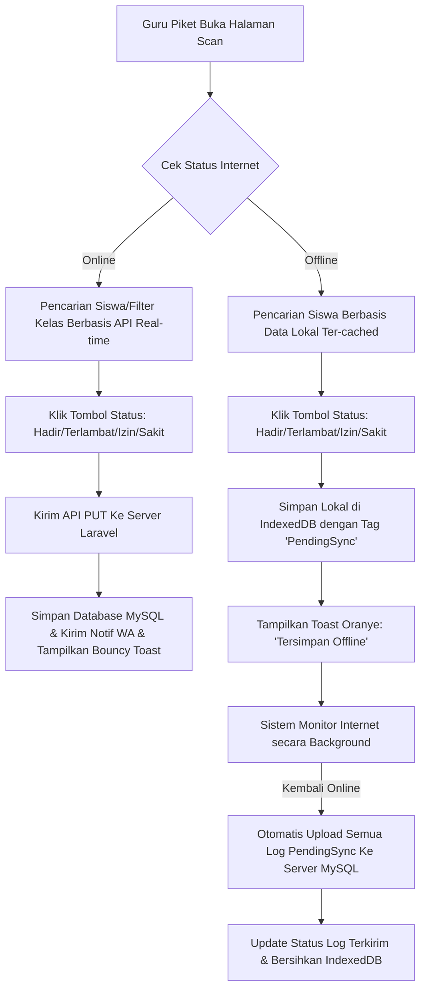

# Detail Fitur Lengkap — Dashboard Guru Piket (F-PIKET)

Dokumen ini berisi spesifikasi fungsional, antarmuka cepat absensi lobi gerbang, spesifikasi animasi toast, dan arsitektur ketahanan offline menggunakan *IndexedDB* untuk Guru Piket.

---

## 1. Alur Kerja Utama (Happy Path & Offline Resiliency Workflow)

---

## 2. Rincian Kebutuhan Fungsional & Teknis

### 2.0 Catatan Implementasi Nyata (Penting untuk Parity Laravel)

*   **Batas waktu batal 30 detik hanya validasi client-side.** Backend `DELETE /api/attendance/manual` **tidak** memvalidasi umur record — secara teknis bisa menghapus `Kehadiran` kapan pun. Tombol "Batal" hanya disembunyikan di UI setelah 30 detik. Jika Laravel butuh jaminan keamanan nyata, tambahkan validasi umur record di server (perbaikan, bukan sekadar migrasi).
*   **Input manual bersifat overwrite tanpa syarat.** `POST /api/attendance/manual` menimpa status kehadiran apa pun yang sudah ada untuk siswa+tanggal tersebut (termasuk hasil scan mandiri siswa sendiri), dan menghapus `LogWa` `TERTUNDA` terkait. Tidak ada aturan "siapa menang jika ada dua sumber data" selain "input terakhir menang".
*   **Tidak ada validasi enum `status`** di endpoint manual/bulk-sync — nilai status yang tidak valid akan gagal di level database, bukan pesan error aplikasi yang rapi.
*   **`bulk-sync` tidak mengisi `tahunAjaran`** pada record yang dibuat (beda dari `scan`/`manual` yang mengisi dari `siswa.kelas.tahunAjaran`) — berpotensi salah rekap tahun ajaran untuk data hasil sinkronisasi offline. Perlu diperbaiki saat porting ke Laravel.

### 2.1 F-DASH-PIKET-01 & 02: Form Cari Cepat & Tombol Pintas Satu-Klik
*   **Kecepatan Input di Gerbang**:
    *   Halaman didesain minimalis berfokus pada kecepatan entri data.
    *   Ketika Guru Piket mengetik huruf di kolom pencarian (min. 2 karakter), sistem langsung menyaring daftar siswa.
    *   Hasil pencarian menampilkan: Nama Siswa, NISN, Kelas, dan 4 tombol pintas berukuran besar di sebelahnya:
        *   `[ HADIR ]` (Warna latar hijau: `#10B981`)
        *   `[ TERLAMBAT ]` (Warna latar kuning: `#F59E0B`)
        *   `[ IZIN ]` (Warna latar biru: `#3B82F6`)
        *   `[ SAKIT ]` (Warna latar indigo: `#6366F1`)
    *   **Mekanisme Satu-Klik (No Modal Dialog)**:
        *   Menekan salah satu tombol tersebut langsung memicu request AJAX (`POST /api/attendance/manual`) untuk memperbarui status kehadiran siswa tanpa membuka jendela dialog konfirmasi/modal pop-up. Ini memangkas waktu pencatatan menjadi kurang dari 1 detik per siswa.

### 2.2 F-DASH-PIKET-03: Tabel Log Harian Guru Piket
*   Tabel log melayang di bagian bawah halaman secara konstan menampilkan 5 nama siswa terakhir yang baru saja sukses diabsenkan manual oleh Guru Piket yang sedang login.
*   Kolom tabel: Jam Input, Nama Siswa, Kelas, Status, dan Tombol Pintas `[Batal]` (jika guru salah menekan tombol, dia memiliki waktu 30 detik untuk membatalkannya langsung di tempat).

### 2.3 F-DASH-PIKET-04: Animasi Bouncy Toast dengan Inisial
*   Setiap kali absensi sukses direkam, pop-up notifikasi toast meluncur dari pojok kanan atas layar dengan efek animasi memantul (*bouncy spring animation*).
*   **Struktur Visual Toast**:
    *   Sisi kiri menampilkan avatar lingkaran berisi 2 huruf inisial nama siswa (e.g. Budi Utomo $\rightarrow$ `BU`) dengan warna latar acak yang kontras.
    *   Sisi kanan menampilkan teks konfirmasi: `"Absen {Nama_Siswa} ({Status}) Berhasil Direkam!"`.
    *   Durasi toast aktif di layar adalah 2 detik sebelum menghilang secara perlahan (*fade-out*).

### 2.4 F-DASH-PIKET-05b: Verifikasi Dispensasi Keterlambatan
*   Guru Piket membuka antrean pengajuan siswa (`GET /api/picket/dispensations`) berisi alasan, foto bukti, dan status `MENUNGGU`.
*   Keputusan satu-klik: **Setujui** atau **Tolak** (`PUT /api/picket/dispensations`) — mencatat `disetujuiOleh` = ID pengguna piket/admin.
*   Setelah disetujui, staf dapat menyesuaikan status kehadiran terkait (mis. `TERLAMBAT` dengan catatan dispensasi) sesuai kebijakan operasional sekolah.

### 2.5 F-DASH-PIKET-05: Arsitektur Offline Cache (IndexedDB & Background Sync)
*   **Prinsip Kerja Offline**:
    *   Aplikasi menggunakan database lokal browser **IndexedDB** melalui `Dexie.js`.
    *   Nama database: **`AbsensiOfflineDatabase`**, versi `1`. Tabel: `siswa` (indeks `id, nisn, nama, namaKelas`) dan `kehadiran_tertunda` (indeks `++id, idSiswa, tanggal, statusSync`). Nama & versi ini wajib direplikasi identik bila IndexedDB tetap dipakai di frontend Laravel/Inertia agar data lama di browser Guru Piket tidak hilang saat cutover.
    *   Saat halaman pertama kali dimuat di pagi hari (ketika online), sistem mengunduh kamus daftar siswa aktif (Nama, NISN, ID, Kelas) ke tabel `siswa` IndexedDB untuk referensi offline.
*   **Skema Penyimpanan IndexedDB saat Internet Putus**:
    *   Ketika Guru Piket menekan tombol absensi saat Wi-Fi mati, sistem gagal menghubungi API `/api/attendance/manual`.
    *   Sistem menangkap exception kegagalan jaringan, lalu menyimpan record absensi secara lokal di IndexedDB dalam tabel `kehadiran_tertunda` dengan skema data:
        `{ idSiswa: 123, tanggal: "2026-06-04", status: "TERLAMBAT", waktuMasuk: "07:05:22", dicatatOleh: 2, statusSync: "PENDING" }`
    *   Tampilan toast otomatis berubah warna menjadi kuning/oranye dengan keterangan: `"Tersimpan Offline: Menunggu internet online."`.
*   **Sinkronisasi Latar Belakang (Background Sync)**:
    *   Halaman dashboard Guru Piket memantau status internet secara konstan menggunakan event listener browser:
        `window.addEventListener('online', syncOfflineData)`
    *   Begitu koneksi internet pulih, fungsi `syncOfflineData` berjalan secara asinkron membaca seluruh data di tabel `kehadiran_tertunda` yang berstatus `PENDING`.
    *   Mengirimkan data tersebut secara berurutan ke backend API `/api/attendance/bulk-sync` menggunakan metode HTTP `POST`.
    *   Setelah backend MySQL berhasil menyimpan seluruh data absensi dan memproses notifikasi WhatsApp tunda, data lokal di IndexedDB dihapus untuk mengosongkan memori.

---

## 3. Skenario Penanganan Error (Error Handling Matrix)

| Kondisi Error | Deteksi Sistem | Tindakan Sistem | Petunjuk Visual bagi Guru Piket |
|---------------|----------------|-----------------|---------------------------------|
| **Data Ganda Tabrakan saat Sync** | Saat online kembali, data yang di-sync ternyata sudah tercatat hadir oleh absensi lain | Backend mendeteksi konstrain kunci unik di MySQL | "Pemberitahuan Sync: Data absensi {Nama_Siswa} pada tanggal ini sudah terekam di server. Data lokal dilewati secara aman." |
| **Gagal Batal Absen** | Guru piket mengklik tombol Batal setelah batas waktu 30 detik berakhir | Frontend menyembunyikan tombol Batal setelah 30 detik | Tombol Batal otomatis hilang dari baris log tabel. |
| **Memori IndexedDB Penuh** | Kuota penyimpanan browser penuh (jarang terjadi) | Menangkap error kuota penyimpanan | "Gagal Menyimpan Offline: Memori browser Anda penuh. Mohon hubungi Admin untuk membersihkan cache browser." |

---

## 4. Rujukan Dokumen
*   Kembali ke [PRD Utama](PRD.md)
*   Lihat spesifikasi [Detail Spesifikasi Database](DATABASE.md)
*   Lihat [SOP.md](SOP.md)
