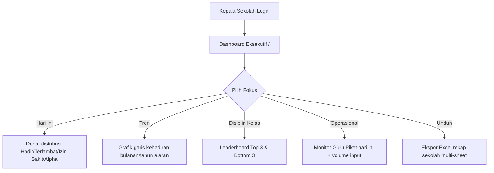

# Detail Fitur Lengkap — Dashboard Kepala Sekolah (F-KEPSEK)

Dokumen ini berisi spesifikasi fungsional Executive Dashboard untuk Kepala Sekolah: visualisasi tren, distribusi harian, leaderboard disiplin, monitor piket, dan ekspor rekap sekolah.

**Acuan:** PRD v3.11 · SRS FR-KEPSEK · data dari `GET /api/dashboard/summary` & `GET /api/reports`

---

## 1. Alur Kerja Utama

---

## 2. Rincian Kebutuhan Fungsional

### 2.1 F-DASH-KEPSEK-01: Grafik Tren Kehadiran Sekolah
*   Grafik garis (*line chart*) interaktif menyajikan tren rata-rata kehadiran harian tingkat sekolah sepanjang tahun ajaran berjalan.
*   Sumber data: agregasi `Kehadiran` dengan filter `tahunAjaran` aktif.
*   Interaksi: hover menampilkan persentase & jumlah absolut per titik tanggal/minggu.

### 2.2 F-DASH-KEPSEK-02: Ekspor Rekap Sekolah Terpadu
*   Tombol unduh laporan rekapitulasi keseluruhan berformat Excel.
*   Setiap kelas dipisahkan otomatis per sheet/tab dalam satu file (pustaka `xlsx`).
*   Isi sheet mengikuti format warna status yang sama dengan ekspor Wali Kelas (lihat [WALI_KELAS.md](WALI_KELAS.md)).

### 2.3 F-DASH-KEPSEK-03: Peringkat Disiplin Kelas (Leaderboard)
*   Widget **Top 3** kelas kehadiran tertinggi dan **Bottom 3** kehadiran terendah (butuh pembinaan) berdasarkan persentase kehadiran bulanan.
*   Persentase dihitung dari status `HADIR` (+ kebijakan lokal apakah `TERLAMBAT` dihitung hadir parsial — default: terlambat tetap masuk kategori hadir fisik tetapi ditandai terpisah di donat harian).
*   Klik nama kelas (jika diizinkan UI) dapat mengarah ke ringkasan kelas tersebut (read-only).

### 2.4 F-DASH-KEPSEK-04: Diagram Donat Distribusi Harian
*   Donat memvisualisasikan pembagian status kehadiran **hari ini** di seluruh sekolah: Hadir, Terlambat, Sakit/Izin, Alpha, serta sisa belum absen jika relevan.
*   Warna mengikuti identitas visual emerald/amber/blue/red di [ARSITEKTUR.md](ARSITEKTUR.md).

### 2.5 F-DASH-KEPSEK-05: Monitor Kinerja Piket
*   Menampilkan nama Guru Piket yang aktif hari ini (dari `JadwalPiket` + `GET /api/picket-schedules/today`).
*   Menampilkan jumlah input manual yang berhasil dicatat oleh akun piket sebagai kontrol operasional gerbang.
*   Membantu Kepala Sekolah menilai apakah pos piket terisi dan aktif.

### 2.6 Batasan Akses
*   Kepala Sekolah **tidak** mengedit master data, pengaturan GPS/WA, atau isi log konseling detail.
*   Kepala Sekolah **boleh** melihat ringkasan bahwa siswa “sudah dibina / belum” di konteks EWS tanpa membuka teks rahasia konseling (kebijakan F-BK).
*   Role `peran = KEPALA_SEKOLAH` diverifikasi di API summary/reports.

---

## 3. Antarmuka & Data

| Elemen UI | API / sumber |
|-----------|----------------|
| Kartu ringkasan hari ini | `/api/dashboard/summary` |
| Tren & leaderboard | Agregasi summary / reports |
| Ekspor Excel sekolah | `/api/reports` + client `xlsx` |
| Piket hari ini | `/api/picket-schedules/today` |

---

## 4. Skenario Error

| Kondisi | Perilaku |
|---------|----------|
| Belum ada data kehadiran bulan berjalan | Chart kosong + empty state “Belum ada data” |
| Jadwal piket hari ini kosong | Widget piket menampilkan “Belum dijadwalkan — hubungi Admin” |
| Gagal ekspor | Toast error + saran coba lagi |

---

## 5. Rujukan Dokumen
*   [PRD.md](PRD.md) · [SRS.md](SRS.md) · [FITUR.md](FITUR.md) · [API.md](API.md)
*   [WALI_KELAS.md](WALI_KELAS.md) (format ekspor)
*   [AGENTS.md](../AGENTS.md)
