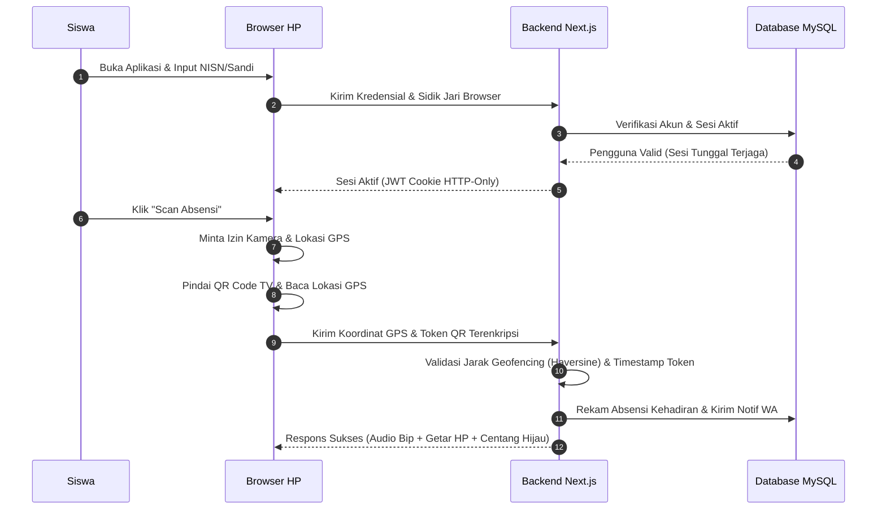

# Detail Fitur Lengkap — Portal Siswa & Scan Mandiri (F-SISWA)

Dokumen ini berisi spesifikasi fungsional, arsitektur antarmuka, penanganan error, dan validasi keamanan untuk Portal Siswa dan fitur Scan Absensi Mandiri.

---

## 1. Alur Kerja Utama (Happy Path Workflow)

---

## 2. Rincian Kebutuhan Fungsional & Teknis

### 2.1 F-SISWA-01: Login & Keamanan Sesi Tunggal
*   **Parameter Input**: `nisn` (VARCHAR, 10 digit angka), `kataSandi` (VARCHAR, min 8 karakter), `sidikJariBrowser` (TEXT hash unik yang di-generate di browser menggunakan pustaka `FingerprintJS` atau gabungan user-agent + resolusi layar + timezone).
*   **Enforcement Sesi Tunggal**:
    *   Setiap kali siswa berhasil login, backend mencocokkan `sidikJariBrowser` yang dikirim dengan data yang tersimpan di kolom `sidikJariBrowser` tabel `Pengguna`.
    *   Jika `sidikJariBrowser` di database kosong, sistem akan menyimpannya secara otomatis.
    *   Jika `sidikJariBrowser` berbeda dengan yang tersimpan, sistem akan menghapus sesi lama di perangkat lain (*force logout*) dengan membatalkan JWT token lama, menyimpan sidik jari baru, dan memblokir sementara akun tersebut untuk melakukan pemindaian selama **5 menit** (`absenDiblokirHingga = Waktu_Sekarang + 5 Menit`).
*   **Validasi Sandi Sementara**:
    *   Akun baru siswa yang diimpor dari data TU memiliki kolom `isPasswordTemp: true`.
    *   Saat login pertama kali, siswa secara otomatis diarahkan ke halaman `/ubah-sandi` dan tidak bisa mengakses portal scan sebelum mengubah kata sandi default-nya.

### 2.2 F-SISWA-02: Dashboard Portal HP Siswa
*   **Layout Antarmuka (UI/UX Concept)**:
    *   Tema cerah dan responsif, dioptimalkan untuk ukuran layar HP minimal 360px.
    *   Bagian atas menampilkan kartu profil siswa: Nama Lengkap, Kelas, dan NISN.
    *   Bagian tengah menampilkan widget visual persentase kehadiran bulanan (diagram meteran bundar). Jika persentase kehadiran di bawah $90\%$, diagram akan berwarna merah sebagai peringatan dini.
    *   Bagian bawah menampilkan riwayat daftar hadir 7 hari terakhir (status: Hadir, Terlambat, Izin, Sakit, Alpha).

### 2.3 F-SISWA-03 & 05: Modul Kamera & Ergonomi HP
*   **Konfigurasi Teknis Kamera**:
    *   Menggunakan pemindaian kamera berbasis browser via pustaka `html5-qrcode` (atau JavaScript `getUserMedia` native).
    *   Kamera diinisialisasi secara asinkronus dengan batasan resolusi `ideal: { width: 640, height: 480 }` untuk menghemat penggunaan RAM pada HP low-end.
    *   Sistem menyertakan tombol **Nyalakan Flash** (jika didukung perangkat kamera belakang) dan tombol **Balik Kamera** (untuk beralih dari kamera belakang ke kamera depan).
    *   **Skeleton Loader**: Selama inisialisasi modul kamera yang biasanya memakan waktu 1–2 detik, sistem menampilkan elemen skeleton bundar yang memudar perlahan untuk menghindari efek visual layar kosong hitam yang membingungkan siswa.
    *   **Ergonomi Area Sentuh**: Ukuran tombol kontrol minimal `48x48px` dengan jarak antar-tombol minimal `16px` untuk mencegah kesalahan sentuh jari (*fat-finger error*).

### 2.4 F-SISWA-04: Validasi Geofencing & Token QR
*   **Perhitungan Geofencing (Formula Haversine)**:
    *   Aplikasi mengambil koordinat GPS perangkat siswa via browser `navigator.geolocation.getCurrentPosition` dengan akurasi tinggi (`enableHighAccuracy: true`, `timeout: 5000`, `maximumAge: 0`).
    *   Sinyal koordinat lintang/bujur dikirim ke backend Next.js bersama token hasil pemindaian.
    *   Backend melakukan komputasi formula Haversine untuk menghitung jarak spasial riil siswa ke koordinat sekolah (`gps_sekolah_latitude`, `gps_sekolah_longitude`) yang diambil dari tabel `Pengaturan`.
    *   Jika hasil jarak melebihi batas radius toleransi sekolah (default: 50 meter), backend mengembalikan kode error `JARAK_TERLALU_JAUH`.
*   **Validasi Token QR Dinamis**:
    *   Token QR Code di-generate di TV display gerbang berisi string JSON terenkripsi (AES-256-CBC) dengan isi data: `{ target: "absensi_smk_ar_rahma", timestamp: 1717454800000, rand: "xyz" }`.
    *   Backend mendekripsi token tersebut dan mencocokkan `timestamp` di dalam token dengan waktu server Next.js saat itu (`Date.now()`).
    *   Jika selisih waktu `Date.now() - timestamp > 10000` (lebih dari 10 detik), backend mengembalikan kode error `TOKEN_KADALUWARSA`.

### 2.5 F-SISWA-06: Feedback Audio & Haptic
*   **Feedback Sukses**:
    *   Browser HP siswa memutar audio bip frekuensi tinggi (bip pendek berdurasi 150ms dengan oscillator 1000Hz).
    *   Memicu vibrasi fisik HP selama 150ms (`navigator.vibrate([150])`) untuk perangkat Android/HP yang mendukung.
    *   Menampilkan animasi visual centang hijau elastis (*elastic scale transition*) dengan tulisan besar "ABSENSI BERHASIL".
*   **Feedback Gagal**:
    *   Browser HP memutar audio bip frekuensi rendah (bip ganda berdurasi 300ms dengan oscillator 200Hz).
    *   Memicu vibrasi fisik HP berupa getaran berdenyut ganda (`navigator.vibrate([100, 50, 100])`).
    *   Menampilkan tanda silang merah dengan keterangan error yang jelas.

---

## 3. Skenario Penanganan Error (Error Handling Matrix)

| Kondisi Error | Deteksi Sistem | Tindakan Sistem | Petunjuk Visual bagi Siswa |
|---------------|----------------|-----------------|----------------------------|
| **Izin Kamera Ditolak** | Exception ditangkap oleh `html5-qrcode` | Menampilkan overlay peringatan bertanda seru | "Izin Kamera Diblokir. Harap klik ikon gembok di sebelah kiri alamat website di browser Anda, ubah izin Kamera menjadi 'Izinkan', lalu refresh halaman." |
| **Izin GPS Ditolak / Mati** | `error.code === error.PERMISSION_DENIED` pada API Geolocation | Menghentikan proses inisialisasi pemindaian | "Akses Lokasi Diblokir. Harap aktifkan GPS HP Anda dan beri izin lokasi pada browser untuk melanjutkan absensi." |
| **Siswa di Luar Radius** | Hasil perhitungan jarak Haversine $> 50$ meter | Mengembalikan respons error `JARAK_TERLALU_JAUH` | "Gagal Absen: Lokasi Anda terlalu jauh dari sekolah (Terdeteksi: X meter dari gerbang)." |
| **Token QR Kedaluwarsa** | Selisih waktu timestamp token $> 10$ detik | Mengembalikan respons error `TOKEN_KADALUWARSA` | "Gagal Absen: Token QR kedaluwarsa. Harap scan kembali kode terbaru yang muncul di layar TV." |
| **Sesi Akun Diblokir** | Percobaan login ganda mendeteksi `Waktu_Sekarang < absenDiblokirHingga` | Menolak permintaan absensi di backend | "Akun Anda diblokir sementara selama 5 menit karena terdeteksi login sharing di perangkat lain." |

---

## 4. Rujukan Dokumen
*   Kembali ke [PRD Utama](PRD.md)
*   Lihat detail [Arsitektur & Spesifikasi Teknis](ARSITEKTUR.md)
*   Lihat [SOP.md](SOP.md)
