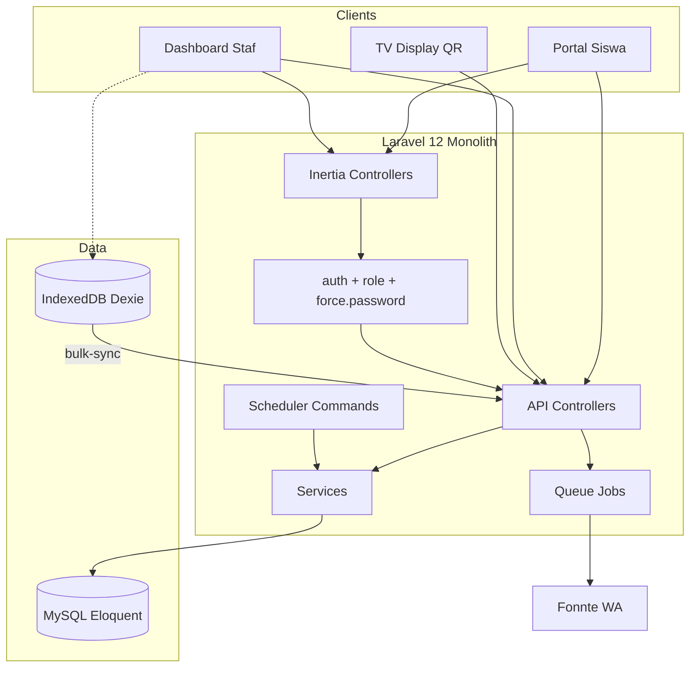

# Peta Sistem Laravel (System Map)

**Versi:** 1.1-L · **Tanggal:** 2026-07-29  
**Catatan:** Peta ini mendeskripsikan **arsitektur target Laravel** untuk proyek absensi ini.  
`graphify-out/graph.json` pada tree Next.js lama **bukan** acuan implementasi baru — regenerate graph setelah kode Laravel ada.

---

## 1. Konteks

---

## 2. Modul Inti

| Modul | Path / Class | Dependensi |
|-------|--------------|------------|
| Auth & RBAC | Middleware + `Pengguna` | Session |
| QR & Scan | `QrTokenService`, `AttendanceScanController` | Geofence, SSE, WA |
| TV Live | `DisplayQr`, `AttendanceLiveStreamController` | SseBroadcast |
| Piket Offline | `Scan/Index`, Dexie, `BulkSync` | Kehadiran |
| WA | `WhatsAppService`, `KirimWaJob` | LogWa, Pengaturan |
| Auto-Alpha | `AutoAlphaService`, `absensi:auto-alpha` | HariLibur, Siswa |
| Admin | `Api\Admin\*` | Audit, Import, Backup |
| BK | EWS + Counseling + SP PDF | LogKonselingBk |
| Laporan | Reports + Excel/PDF | Kehadiran |

---

## 3. Alur Lintas Modul

### Scan siswa
Inertia Student → `POST /api/attendance/scan` → QrToken + Geofence → `Kehadiran` → SseBroadcast → TV  
→ `KirimWaJob` → Fonnte → `LogWa`

### Piket offline
Dexie pending → online → `bulk-sync` → DB → WA jobs

### Auto-alpha pagi
Scheduler → `AutoAlphaService` → insert ALPHA → WA ortu → (opsional) digest wali

### Admin import
Admin page → import controller → PhpSpreadsheet/XLSX → upsert Kelas/Siswa/Guru + Pengguna → Audit

---

## 4. Titik Kritis (God Nodes Laravel)

Perubahan di bawah wajib regresi lintas role:

1. `Pengguna` auth + middleware role  
2. `QrTokenService` / scan controller  
3. `WhatsAppService` + `KirimWaJob`  
4. `AutoAlphaService`  
5. `SseBroadcastService`  
6. Helper sanitasi nomor WA  

---

## 5. Setelah Kode Laravel Ada

1. Jalankan graphify pada tree Laravel.  
2. Ganti statistik komunitas di dokumen ini.  
3. Pastikan tidak ada import cycle Services ↔ Controllers yang tidak sehat.

---

## Rujukan
[ARSITEKTUR.md](ARSITEKTUR.md) · [SOP.md](SOP.md) · [API.md](API.md) · [MIGRASI_LARAVEL.md](MIGRASI_LARAVEL.md)
