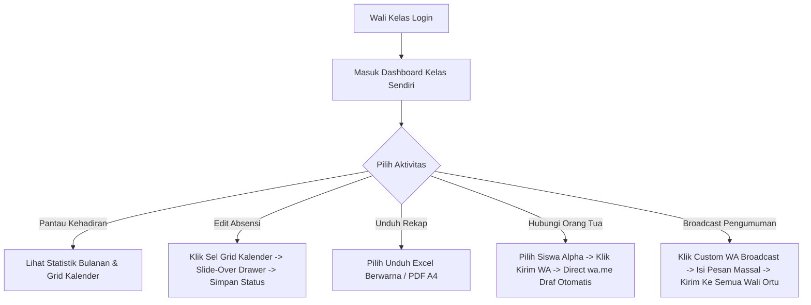

# Detail Fitur Lengkap — Dashboard Wali Kelas (F-WALI)

Dokumen ini berisi spesifikasi fungsional, arsitektur antarmuka dashboard, format laporan, dan aturan pengiriman WhatsApp broadcast untuk Wali Kelas (akses terbatas pada kelasnya sendiri).

---

## 1. Alur Kerja Utama (Happy Path Workflow)

---

## 2. Rincian Kebutuhan Fungsional & Teknis

### 2.1 F-DASH-WALI-01: Visual Statistik Kehadiran Kelas
*   **Tampilan Utama Dashboard**:
    *   Menggunakan layout Bento Grid modern.
    *   **Kartu 1: Persentase Kehadiran Kelas**: Diagram donat dinamis (*donut chart*) yang menampilkan persentase siswa hadir hari ini (misal: "95% Siswa Hadir").
    *   **Kartu 2: Ringkasan Hari Ini**: Angka total siswa Hadir, Terlambat, Izin, Sakit, dan Alpha.
    *   **Peringatan Visual (Color Threshold)**: Jika rata-rata kehadiran kumulatif bulanan kelas di bawah $90\%$, batas tepi kartu donat statistik akan berkedip perlahan dengan warna merah tebal dan memunculkan teks alert: `"PERINGATAN: Kehadiran kelas di bawah standar minimal sekolah!"`.

### 2.2 F-DASH-WALI-02: Hubungi Orang Tua Cepat
*   **Mekanisme Integrasi WhatsApp**:
    *   Wali Kelas dapat melihat daftar nama siswa yang tidak hadir (Alpha) hari itu di dashboard.
    *   Di samping nama siswa terdapat tombol ikon WhatsApp berwarna hijau.
    *   Saat diklik, sistem membuka tab baru mengarah ke URL WhatsApp API:
        `https://api.whatsapp.com/send?phone=TELEPON_ORTU&text=PESAN_URGENT`
    *   **Formulasi Teks Pesan Otomatis (PESAN_URGENT)**:
        `"Assalamu'alaikum Wr. Wb. Bapak/Ibu Wali dari {Nama_Siswa}. Kami dari pihak sekolah SMK Ar Rahma ingin mengabarkan bahwa pada hari ini, {Hari}, {Tanggal}, putra/putri Bapak/Ibu terdata ALPHA (tidak hadir tanpa keterangan) pada jam masuk sekolah. Mohon konfirmasi keterangan ketidak-hadiran putra/putri Bapak/Ibu ke Wali Kelas. Terima kasih."`
    *   Sistem secara otomatis mengonversi variabel `{Nama_Siswa}`, `{Hari}`, dan `{Tanggal}` secara dinamis berdasarkan data siswa bersangkutan sebelum redirect dilakukan.

### 2.3 F-DASH-WALI-03: Kalender Kehadiran & Panel Slide-Over
*   **GitHub-style Attendance Grid**:
    *   Layout rekapitulasi kehadiran berupa grid tanggal dari tanggal 1 sampai 31 (kolom) dan nama siswa (baris).
    *   Setiap sel tanggal menampilkan kotak kecil berwarna pastel sesuai status kehadiran hari itu:
        *   Hijau (Hadir): `#10B981` (Emerald 500)
        *   Kuning (Terlambat): `#F59E0B` (Amber 500)
        *   Biru (Izin/Sakit): `#3B82F6` (Blue 500)
        *   Merah (Alpha): `#EF4444` (Red 500)
        *   Abu-abu (Hari Libur/Magang): `#6B7280` (Gray 500)
    *   **Slide-Over Drawer (Panel Samping)**:
        *   Ketika kotak sel tanggal diklik oleh Wali Kelas, panel laci samping akan meluncur mulus dari arah kanan layar.
        *   Panel menampilkan detail kehadiran siswa yang diklik pada tanggal tersebut: Nama Siswa, NISN, Tanggal Absensi, Jam Masuk (jika absen via QR), Lokasi Koordinat & Peta Mini (jika scan mandiri), serta Dropdown Pilihan Status (`Hadir`, `Terlambat`, `Izin`, `Sakit`, `Alpha`).
        *   Wali Kelas dapat langsung mengubah status (misal mengganti Alpha menjadi Sakit karena surat dokter baru diserahkan) dan menuliskan catatan keterangan (e.g. "Surat sakit dokter diserahkan wali murid"), lalu menekan tombol `[Simpan Status]`. Proses ini menggunakan AJAX/API call (`PUT /api/attendance/:id`) secara asinkron tanpa memuat ulang seluruh halaman.

### 2.4 F-DASH-WALI-04: Laporan & Ekspor Berwarna (Excel & PDF)
*   **Ekspor Excel Berwarna**:
    *   Menggunakan pustaka `xlsx` atau `exceljs`.
    *   File Excel yang diunduh memiliki pemformatan warna otomatis (*Conditional Formatting*):
        *   Seluruh sel dengan nilai status "HADIR" otomatis diarsir dengan warna latar hijau muda (`#E6F4EA`) dan warna teks hijau tua (`#137333`).
        *   Status "TERLAMBAT" diarsir kuning muda (`#FEF7E0`) dan teks kuning tua (`#B06000`).
        *   Status "Sakit/Izin" diarsir biru muda (`#E8F0FE`) dan teks biru tua (`#1A73E8`).
        *   Status "ALPHA" diarsir merah muda (`#FCE8E6`) dan teks merah tua (`#C5221F`).
*   **Ekspor PDF A4**:
    *   Laporan PDF harian atau rekap bulanan di-generate menggunakan pustaka `@react-pdf/renderer` dengan tata letak rapi, logo resmi SMK Ar Rahma di header, tabel bergaris bersih, dan area tanda tangan Wali Kelas di pojok kanan bawah.

### 2.5 F-DASH-WALI-08: Custom WhatsApp Broadcast Massal
*   **Mekanisme Broadcast Massal**:
    *   Tombol `"Custom WA Broadcast"` membuka modal pop-up berisi area input teks (*textarea*) kosong.
    *   Wali Kelas dapat mengetikkan pesan pengumuman/himbauan khusus kelasnya (misal: pengumuman libur dadakan, classmeeting, atau rapat wali murid).
    *   Terdapat checkbox pilihan target: `[ ] Semua Orang Tua`, `[ ] Hanya Orang Tua Siswa Terlambat Hari Ini`, `[ ] Hanya Orang Tua Siswa Alpha Hari Ini`.
    *   Setelah tombol `[Kirim Broadcast]` ditekan, backend Next.js memasukkan pesan-pesan tersebut ke dalam antrean pengiriman WhatsApp dengan jeda delay acak untuk memproses pengiriman satu per satu secara asinkron.

---

## 3. Skenario Penanganan Error (Error Handling Matrix)

| Kondisi Error | Deteksi Sistem | Tindakan Sistem | Petunjuk Visual bagi Wali Kelas |
|---------------|----------------|-----------------|---------------------------------|
| **Perubahan Absensi Terkunci** | Wali kelas mencoba mengubah absensi tahun ajaran yang sudah diarsip (historis) | Backend menolak kueri `PUT` database | "Gagal Menyimpan: Data absensi tahun ajaran lampau telah dikunci dan tidak dapat diubah kembali." |
| **WhatsApp Ortu Tidak Valid** | Nomor HP orang tua siswa tidak valid (e.g. `0` atau berisi teks) saat Wali Kelas mengklik tombol Hubungi Ortu | Validasi frontend mendeteksi format tidak standar | "Gagal membuka WhatsApp: Nomor telepon orang tua siswa belum diisi atau format nomor salah. Harap perbarui data siswa terlebih dahulu di menu Siswa." |
| **Gagal Unduh Rekap** | Database MySQL sibuk atau timeout saat men-generate file Excel kelas | Menangkap exception kueri dan mengembalikan kode status HTTP 500 | "Gagal Mengunduh: Terjadi gangguan koneksi server. Harap coba unduh kembali beberapa saat lagi." |

---

## 4. Rujukan Dokumen
*   Kembali ke [PRD Utama](PRD.md)
*   Lihat spesifikasi [Detail Spesifikasi Database](DATABASE.md)
*   Lihat [SOP.md](SOP.md)
