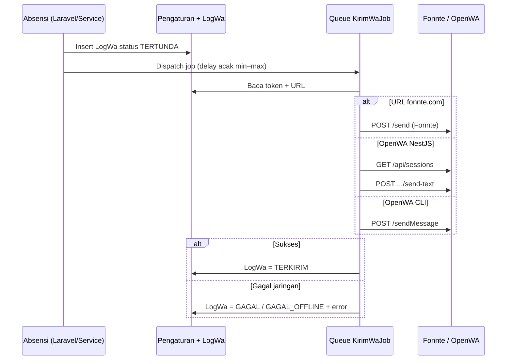

# Integrasi WhatsApp Gateway — Fonnte & OpenWA

**Versi:** 1.0 · **Tanggal:** 2026-07-29  
**Acuan kode produk:** `src/lib/whatsapp.ts`, `src/app/api/admin/wa-status/route.ts`  
**Target Laravel:** `App\Services\WhatsAppService` + `App\Jobs\KirimWaJob` (parity perilaku di bawah)

Dokumen ini menjelaskan **cara mendapat token**, **menyimpan konfigurasi**, **deteksi provider**, **pengiriman**, **antrean**, dan **uji koneksi** untuk gateway WhatsApp.

---

## 1. Ringkasan

Sistem mendukung **dua provider** lewat pengaturan yang sama:

| Provider | Kapan dipakai | Token | URL |
|----------|---------------|-------|-----|
| **Fonnte** | Default jika URL mengandung `fonnte.com` atau URL kosong (fallback) | Token API Fonnte | `https://api.fonnte.com` |
| **OpenWA NestJS** | URL self-hosted; `GET /api/sessions` sukses | API Key / Bearer | mis. `https://openwa.sekolah.local` |
| **OpenWA CLI (legacy)** | URL self-hosted; `/api/sessions` gagal | Bearer token | base URL + `/sendMessage` |

Deteksi otomatis di backend:

1. Baca `wa_gateway_token` + `wa_gateway_url` dari tabel `Pengaturan` (fallback env).  
2. Jika `baseUrl` **mengandung** `fonnte.com` → jalur Fonnte.  
3. Jika tidak → coba OpenWA NestJS (`/api/sessions`); jika gagal → OpenWA CLI `/sendMessage`.

---

## 2. Cara Mendapatkan Token

### 2.1 Fonnte

1. Daftar / login di [fonnte.com](https://fonnte.com).  
2. Hubungkan perangkat WhatsApp (scan QR di dashboard Fonnte).  
3. Salin **API Token** dari panel Fonnte.  
4. Pastikan paket/kuota aktif (status device connected).  
5. Simpan token ke sistem (lihat §3).

**Endpoint kirim:** `POST https://api.fonnte.com/send`  
**Header:** `Authorization: {token}` (tanpa prefix `Bearer` di implementasi saat ini)  
**Body:** `{ "target": "62812...", "message": "..." }`  
**Sukses:** `response.data.status === true`

### 2.2 OpenWA (NestJS / self-hosted)

1. Deploy instance OpenWA (NestJS API) di server sekolah/VPS.  
2. Di dashboard OpenWA: buat **session**, scan QR WhatsApp hingga status `ready`.  
3. Ambil **API Key** / token auth yang dikonfigurasi di OpenWA (dipakai sebagai `X-API-Key` dan `Authorization: Bearer {token}`).  
4. Catat **base URL** publik/internal (contoh `https://wa-api.smkami.sch.id`) — **tanpa** trailing slash wajib (sistem akan trim).  
5. Simpan token + URL ke sistem (§3).

**Deteksi sesi:** `GET {baseUrl}/api/sessions`  
**Kirim teks:** `POST {baseUrl}/api/sessions/{sessionId}/messages/send-text`  
**Body:** `{ "chatId": "62812...@c.us", "text": "..." }`  
**Session dipilih:** status `ready` jika ada, else session pertama.

### 2.3 OpenWA CLI (legacy fallback)

Jika NestJS sessions tidak tersedia, backend mengirim ke:

`POST {baseUrl}/sendMessage`  
Body: `{ "to": "62812...@c.us", "message": "..." }`  
Header: `Authorization: Bearer {token}` (otomatis menambah `Bearer` jika belum ada).

---

## 3. Menyimpan Token & URL di Sistem

### 3.1 Kunci `Pengaturan` (utama)

| Kunci | Contoh nilai | Wajib |
|-------|--------------|-------|
| `wa_gateway_token` | Token Fonnte **atau** API Key OpenWA | Ya |
| `wa_gateway_url` | `https://api.fonnte.com` **atau** URL OpenWA | Ya untuk OpenWA; Fonnte bisa default |
| `wa_delay_min` | `2` (detik) | Ya (antrean) |
| `wa_delay_max` | `5` (detik) | Ya (antrean) |

Placeholder seed `fonnte_token_placeholder` = **belum dikonfigurasi** → pengiriman ditolak dengan error jelas.

### 3.2 Fallback Environment

| Env | Fungsi |
|-----|--------|
| `FONNTE_TOKEN` | Dipakai jika `wa_gateway_token` kosong |
| `WA_GATEWAY_URL` | Dipakai jika `wa_gateway_url` kosong; default Fonnte |

**Prioritas:** nilai di `Pengaturan` > env.

### 3.3 UI Admin

Halaman `/admin/settings` (Laravel) / Settings Admin:

1. Isi **Token Gateway**.  
2. Isi **URL Gateway** (`https://api.fonnte.com` atau URL OpenWA).  
3. Simpan → tulis `Pengaturan` + idealnya `LogAuditAdmin` (`UPDATE_WA_TOKEN` / sejenis).  
4. Klik **Uji Koneksi WhatsApp** (kirim ke nomor uji).  
5. Pantau widget status (`GET /api/admin/wa-status`): CONNECTED/DISCONNECTED, nama device, kuota (Fonnte) / status session (OpenWA).

---

## 4. Alur Pengiriman



### 4.1 Normalisasi nomor
Sebelum kirim, nomor orang tua/staf harus format internasional `62…` (tanpa `+`, tanpa spasi).  
Helper: `bersihkanNomorHp()` / `cleanWaPhone()`.  
OpenWA menambah sufiks `@c.us` jika belum ada `@`.

### 4.2 Antrean & delay
* `wa_delay_min` / `wa_delay_max` (detik) → jeda acak anti-spam Meta.  
* Laravel: `KirimWaJob::dispatch(...)->delay(now()->addSeconds($jeda))`.  
* Worker wajib hidup: `php artisan queue:work`.

### 4.3 Pemicu bisnis yang mengirim WA
* Scan absensi sukses (ortu)  
* Absensi manual / bulk-sync  
* Auto-alpha (ortu + opsional digest wali)  
* Broadcast wali/admin  
* Cron `/api/cron/wa-digest`  
* Uji koneksi Admin  

---

## 5. API Admin terkait WA

| Method | Path | Fungsi |
|--------|------|--------|
| GET | `/api/admin/wa-status` | Status gateway (Fonnte device/quota atau OpenWA session) |
| POST | `/api/admin/wa-status` | Uji kirim ke nomor tertentu (`kirimWaLangsung`) |
| GET/PUT | `/api/admin/settings` | Simpan `wa_gateway_*` & delay |
| (opsional) | `/api/admin/wa-retry` | Kirim ulang `GAGAL` / `GAGAL_OFFLINE` |

Hanya **ADMIN**.

---

## 6. Status `LogWa`

| Status | Arti |
|--------|------|
| `TERTUNDA` | Masuk antrean, belum dikirim |
| `TERKIRIM` | Gateway menerima sukses |
| `GAGAL` | Ditolak gateway / error aplikasi (dipakai untuk **semua** jenis kegagalan di kode existing) |
| `GAGAL_OFFLINE` | Dimaksudkan untuk "gagal karena jaringan putus" — **ada di enum tapi tidak pernah di-set oleh kode saat ini**. `WhatsAppService`/`kirimWaLangsung` hanya menghasilkan `TERKIRIM` atau `GAGAL`. Putuskan apakah Laravel mengaktifkan pembedaan ini (retry otomatis untuk `GAGAL_OFFLINE`) atau membiarkannya seperti semula. |

### 6.1 Catatan `cron/wa-digest` (perilaku ganda yang perlu keputusan)

Endpoint `GET /api/cron/wa-digest` di kode existing **melakukan dua hal sekaligus**:
1. Menghitung & mengirim **ringkasan** kehadiran hari ini ke nomor **Wali Kelas** (fungsi utama sesuai nama endpoint).
2. **Membuat record `Kehadiran` status `ALPHA`** untuk siswa yang belum absen — logika yang tumpang tindih sebagian dengan `AutoAlphaService`/`runAutoAlpha()` — **tanpa** mengirim WA individual ke orang tua siswa yang baru di-ALPHA-kan tersebut (berbeda dari alur auto-alpha utama yang mengirim WA ortu + digest).

Ini kemungkinan **inkonsistensi/bug warisan** (sudah dicatat sebagai temuan di `RESEARCH.md`), bukan spesifikasi resmi. **Keputusan yang harus diambil sebelum Laravel**:
- (a) Hilangkan pembuatan ALPHA dari `wa-digest`, biarkan hanya `AutoAlphaService` yang berwenang mengubah status kehadiran menjadi ALPHA, atau
- (b) Pertahankan perilaku ganda ini dan tambahkan pengiriman WA ortu yang hilang agar konsisten dengan alur auto-alpha utama.

Jangan mengimplementasikan `CronWaDigestController` Laravel dengan meniru kode lama tanpa keputusan eksplisit ini.

---

## 7. Checklist konfigurasi “WA siap kirim”

### Fonnte
- [ ] Token dari dashboard Fonnte (bukan placeholder)  
- [ ] `wa_gateway_url` = `https://api.fonnte.com` (atau kosong + default)  
- [ ] Device Fonnte connected  
- [ ] Uji kirim Admin sukses  
- [ ] `queue:work` berjalan (Laravel)  

### OpenWA
- [ ] Instance OpenWA online di URL yang diisi  
- [ ] API Key disimpan di `wa_gateway_token`  
- [ ] Minimal 1 session status `ready`  
- [ ] `GET {url}/api/sessions` accessible dari server absensi (firewall)  
- [ ] Uji kirim Admin sukses  
- [ ] Queue worker berjalan  

---

## 8. Error umum

| Gejala | Penyebab | Perbaikan |
|--------|----------|-----------|
| “Token … belum dikonfigurasi” | Placeholder / kosong | Isi token di Pengaturan |
| OpenWA DISCONNECTED / no sessions | Belum scan QR session | Buat & scan session di OpenWA |
| Timeout axios | URL salah / firewall | Cek `wa_gateway_url`, izinkan outbound dari server absensi |
| Fonnte `status: false` | Kuota / nomor / device | Cek panel Fonnte |
| Pesan tidak pernah terkirim tapi LogWa TERTUNDA | Queue worker mati | `php artisan queue:work` / supervisor |
| Nomor tidak sampai | Format lokal `08…` | Pastikan sanitasi `62…` |

---

## 9. Spesifikasi Laravel (parity)

`WhatsAppService` wajib mengimplementasikan logika setara §1–§4:

* Baca settings `wa_gateway_token`, `wa_gateway_url`, delay.  
* Branch Fonnte vs OpenWA NestJS vs CLI.  
* Timeout HTTP ~10s (status ~3s untuk probe sessions).  
* Tulis/update `LogWa`.  
* Jangan hardcode token di source.

Env contoh:

```env
FONNTE_TOKEN=
WA_GATEWAY_URL=https://api.fonnte.com
QUEUE_CONNECTION=database
```

Untuk OpenWA, isi URL di **Pengaturan** (bukan harus env), contoh:

```
wa_gateway_url = https://openwa.internal:3001
wa_gateway_token = <api-key-openwa>
```

---

## 10. Keamanan

* Token gateway = rahasia; audit saat diubah.  
* Jangan commit token ke git.  
* Batasi akses UI settings & `wa-status` ke Admin.  
* Delay acak wajib untuk broadcast massal.  
* Warm-up nomor pengirim sebelum production massal (lihat RESEARCH).

---

## 11. Rujukan
[ADMIN.md](ADMIN.md) · [ARSITEKTUR.md](ARSITEKTUR.md) · [API.md](API.md) · [DATABASE.md](DATABASE.md) · [MIGRASI_LARAVEL.md](MIGRASI_LARAVEL.md) · [SOP.md](SOP.md)
